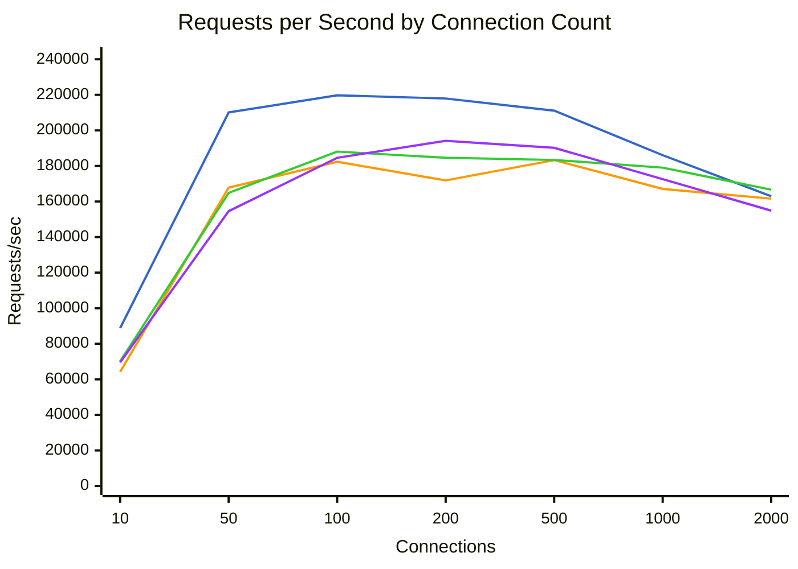
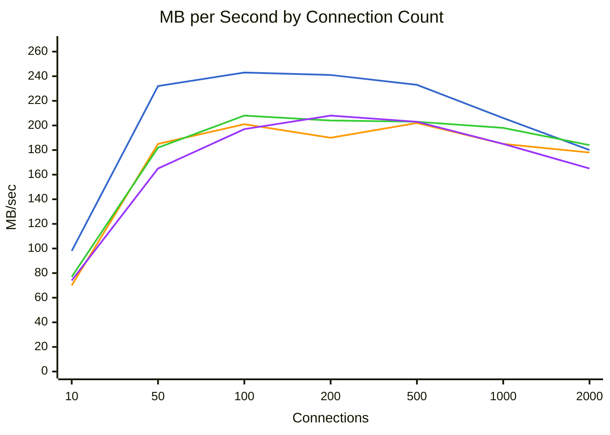
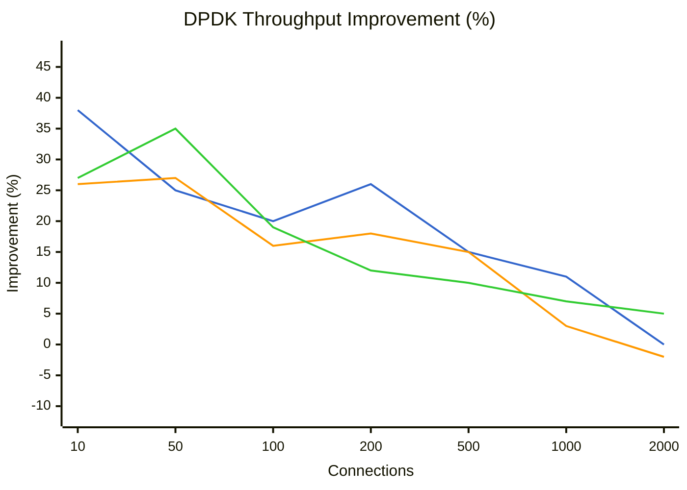
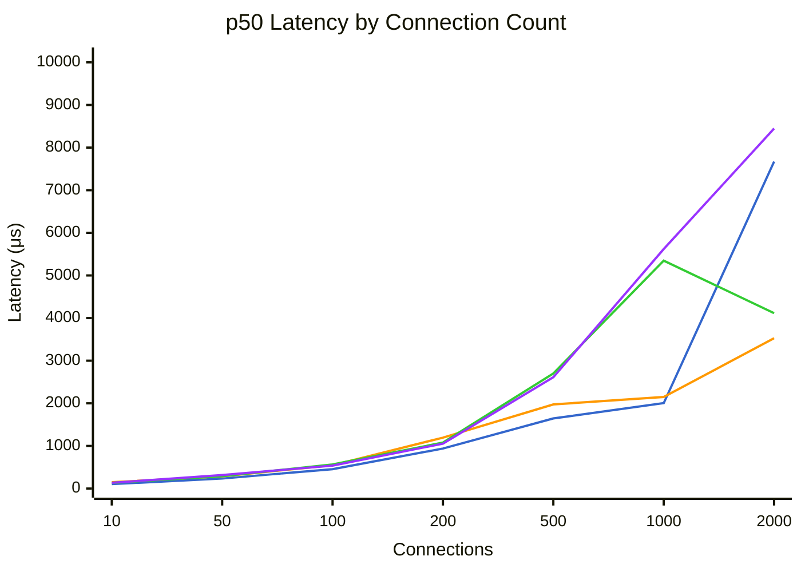
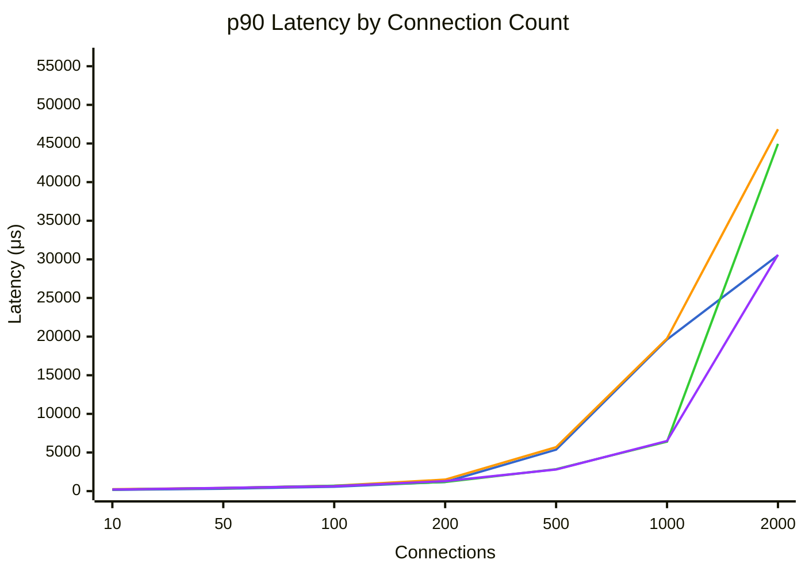
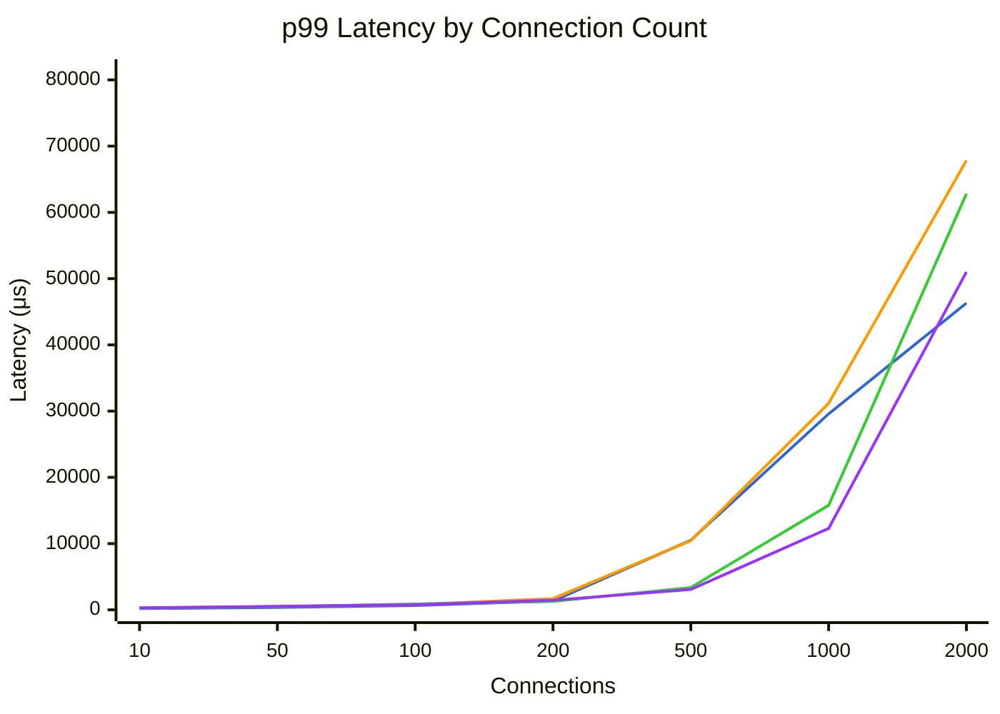

# Benchmark Comparison

Generated: 2026-01-28T22:15:14.176146

## Summary

| Mode | Connections | Requests/sec | MB/sec | p50 (μs) | p99 (μs) | Errors |
|------|-------------|--------------|--------|----------|----------|--------|
| dpdk | 10 | 88800 | 98.2 | 105 | 204 | 0 |
| dpdk | 50 | 210105 | 232.4 | 235 | 361 | 0 |
| dpdk | 100 | 219736 | 243.1 | 455 | 656 | 0 |
| dpdk | 200 | 217940 | 241.3 | 939 | 1336 | 0 |
| dpdk | 500 | 211120 | 233.8 | 1645 | 10511 | 0 |
| dpdk | 1000 | 186052 | 206.0 | 2004 | 29583 | 0 |
| dpdk | 2000 | 163001 | 180.5 | 7671 | 46303 | 0 |
| tokio | 10 | 64173 | 70.9 | 148 | 321 | 0 |
| tokio | 50 | 167797 | 185.6 | 288 | 484 | 0 |
| tokio | 100 | 182387 | 201.8 | 547 | 804 | 0 |
| tokio | 200 | 171873 | 190.2 | 1195 | 1691 | 0 |
| tokio | 500 | 183283 | 202.9 | 1974 | 10423 | 0 |
| tokio | 1000 | 167111 | 185.0 | 2149 | 31167 | 0 |
| tokio | 2000 | 161606 | 178.9 | 3527 | 67839 | 0 |
| tokio-local | 10 | 70073 | 77.5 | 133 | 285 | 0 |
| tokio-local | 50 | 164854 | 182.4 | 289 | 461 | 0 |
| tokio-local | 100 | 188098 | 208.1 | 567 | 872 | 0 |
| tokio-local | 200 | 184592 | 204.3 | 1079 | 1280 | 0 |
| tokio-local | 500 | 183373 | 203.0 | 2701 | 3369 | 0 |
| tokio-local | 1000 | 179061 | 198.3 | 5347 | 15775 | 0 |
| tokio-local | 2000 | 166664 | 184.5 | 4115 | 62815 | 0 |
| kimojio | 10 | 69507 | 74.4 | 135 | 289 | 0 |
| kimojio | 50 | 154581 | 165.6 | 318 | 532 | 0 |
| kimojio | 100 | 184578 | 197.7 | 538 | 757 | 0 |
| kimojio | 200 | 194155 | 208.0 | 1054 | 1456 | 0 |
| kimojio | 500 | 190208 | 203.9 | 2611 | 3081 | 0 |
| kimojio | 1000 | 172605 | 185.0 | 5619 | 12287 | 0 |
| kimojio | 2000 | 154853 | 166.0 | 8447 | 51007 | 0 |

## Throughput Comparison



**Legend:** dpdk (blue) | tokio (orange) | tokio-local (green) | kimojio (purple)


## Bandwidth Comparison



**Legend:** dpdk (blue) | tokio (orange) | tokio-local (green) | kimojio (purple)


## DPDK Throughput Improvement

Percentage improvement of DPDK over other modes (positive = DPDK is faster).



**Legend:** vs tokio (blue) | vs tokio-local (orange) | vs kimojio (green)


## Latency Comparison (p50)



**Legend:** dpdk (blue) | tokio (orange) | tokio-local (green) | kimojio (purple)


## Latency Comparison (p90)



**Legend:** dpdk (blue) | tokio (orange) | tokio-local (green) | kimojio (purple)


## Latency Comparison (p99)



**Legend:** dpdk (blue) | tokio (orange) | tokio-local (green) | kimojio (purple)


## Raw Data

### dpdk

<details>
<summary>Click to expand</summary>

```json
{
  "benchmark_time": "2026-01-29T06:03:17+00:00",
  "results": [
    {
      "url": "http://10.0.0.5:8080/",
      "connections": 10,
      "duration_secs": 20.0,
      "mode": "raw",
      "worker_threads": 2,
      "timeout_ms": 5000,
      "requests": 1775993,
      "errors": 0,
      "gb_read": 1.92,
      "requests_per_sec": 88799.65,
      "mb_per_sec": 98.18,
      "latency": {
        "p50_us": 105,
        "p75_us": 131,
        "p90_us": 155,
        "p99_us": 204,
        "avg_us": 111,
        "max_us": 1530,
        "stdev_us": 32
      }
    },
    {
      "url": "http://10.0.0.5:8080/",
      "connections": 50,
      "duration_secs": 20.0,
      "mode": "raw",
      "worker_threads": 2,
      "timeout_ms": 5000,
      "requests": 4202108,
      "errors": 0,
      "gb_read": 4.54,
      "requests_per_sec": 210105.4,
      "mb_per_sec": 232.43,
      "latency": {
        "p50_us": 235,
        "p75_us": 267,
        "p90_us": 298,
        "p99_us": 361,
        "avg_us": 237,
        "max_us": 7807,
        "stdev_us": 120
      }
    },
    {
      "url": "http://10.0.0.5:8080/",
      "connections": 100,
      "duration_secs": 20.0,
      "mode": "raw",
      "worker_threads": 2,
      "timeout_ms": 5000,
      "requests": 4394715,
      "errors": 0,
      "gb_read": 4.75,
      "requests_per_sec": 219735.75,
      "mb_per_sec": 243.1,
      "latency": {
        "p50_us": 455,
        "p75_us": 523,
        "p90_us": 574,
        "p99_us": 656,
        "avg_us": 454,
        "max_us": 3165,
        "stdev_us": 99
      }
    },
    {
      "url": "http://10.0.0.5:8080/",
      "connections": 200,
      "duration_secs": 20.0,
      "mode": "raw",
      "worker_threads": 2,
      "timeout_ms": 5000,
      "requests": 4358806,
      "errors": 0,
      "gb_read": 4.71,
      "requests_per_sec": 217940.3,
      "mb_per_sec": 241.31,
      "latency": {
        "p50_us": 939,
        "p75_us": 1074,
        "p90_us": 1186,
        "p99_us": 1336,
        "avg_us": 916,
        "max_us": 6411,
        "stdev_us": 225
      }
    },
    {
      "url": "http://10.0.0.5:8080/",
      "connections": 500,
      "duration_secs": 20.0,
      "mode": "raw",
      "worker_threads": 2,
      "timeout_ms": 5000,
      "requests": 4222395,
      "errors": 0,
      "gb_read": 4.57,
      "requests_per_sec": 211119.75,
      "mb_per_sec": 233.76,
      "latency": {
        "p50_us": 1645,
        "p75_us": 2155,
        "p90_us": 5363,
        "p99_us": 10511,
        "avg_us": 2360,
        "max_us": 209151,
        "stdev_us": 2099
      }
    },
    {
      "url": "http://10.0.0.5:8080/",
      "connections": 1000,
      "duration_secs": 20.0,
      "mode": "raw",
      "worker_threads": 2,
      "timeout_ms": 5000,
      "requests": 3721034,
      "errors": 0,
      "gb_read": 4.02,
      "requests_per_sec": 186051.7,
      "mb_per_sec": 206.0,
      "latency": {
        "p50_us": 2004,
        "p75_us": 2625,
        "p90_us": 19631,
        "p99_us": 29583,
        "avg_us": 5354,
        "max_us": 204543,
        "stdev_us": 7707
      }
    },
    {
      "url": "http://10.0.0.5:8080/",
      "connections": 2000,
      "duration_secs": 20.0,
      "mode": "raw",
      "worker_threads": 2,
      "timeout_ms": 5000,
      "requests": 3260023,
      "errors": 0,
      "gb_read": 3.52,
      "requests_per_sec": 163001.15,
      "mb_per_sec": 180.48,
      "latency": {
        "p50_us": 7671,
        "p75_us": 10551,
        "p90_us": 30527,
        "p99_us": 46303,
        "avg_us": 12184,
        "max_us": 259455,
        "stdev_us": 10893
      }
    }
  ]
}
```

</details>

### tokio

<details>
<summary>Click to expand</summary>

```json
{
  "benchmark_time": "2026-01-29T06:06:36+00:00",
  "results": [
    {
      "url": "http://10.0.0.4:8080/",
      "connections": 10,
      "duration_secs": 20.0,
      "mode": "raw",
      "worker_threads": 2,
      "timeout_ms": 5000,
      "requests": 1283459,
      "errors": 0,
      "gb_read": 1.39,
      "requests_per_sec": 64172.95,
      "mb_per_sec": 70.94,
      "latency": {
        "p50_us": 148,
        "p75_us": 189,
        "p90_us": 248,
        "p99_us": 321,
        "avg_us": 161,
        "max_us": 20911,
        "stdev_us": 99
      }
    },
    {
      "url": "http://10.0.0.4:8080/",
      "connections": 50,
      "duration_secs": 20.0,
      "mode": "raw",
      "worker_threads": 2,
      "timeout_ms": 5000,
      "requests": 3355948,
      "errors": 0,
      "gb_read": 3.63,
      "requests_per_sec": 167797.4,
      "mb_per_sec": 185.63,
      "latency": {
        "p50_us": 288,
        "p75_us": 344,
        "p90_us": 398,
        "p99_us": 484,
        "avg_us": 297,
        "max_us": 6503,
        "stdev_us": 82
      }
    },
    {
      "url": "http://10.0.0.4:8080/",
      "connections": 100,
      "duration_secs": 20.0,
      "mode": "raw",
      "worker_threads": 2,
      "timeout_ms": 5000,
      "requests": 3647743,
      "errors": 0,
      "gb_read": 3.94,
      "requests_per_sec": 182387.15,
      "mb_per_sec": 201.77,
      "latency": {
        "p50_us": 547,
        "p75_us": 626,
        "p90_us": 690,
        "p99_us": 804,
        "avg_us": 546,
        "max_us": 5179,
        "stdev_us": 120
      }
    },
    {
      "url": "http://10.0.0.4:8080/",
      "connections": 200,
      "duration_secs": 20.0,
      "mode": "raw",
      "worker_threads": 2,
      "timeout_ms": 5000,
      "requests": 3437459,
      "errors": 0,
      "gb_read": 3.72,
      "requests_per_sec": 171872.95,
      "mb_per_sec": 190.22,
      "latency": {
        "p50_us": 1195,
        "p75_us": 1358,
        "p90_us": 1492,
        "p99_us": 1691,
        "avg_us": 1161,
        "max_us": 10439,
        "stdev_us": 296
      }
    },
    {
      "url": "http://10.0.0.4:8080/",
      "connections": 500,
      "duration_secs": 20.0,
      "mode": "raw",
      "worker_threads": 2,
      "timeout_ms": 5000,
      "requests": 3665658,
      "errors": 0,
      "gb_read": 3.96,
      "requests_per_sec": 183282.9,
      "mb_per_sec": 202.93,
      "latency": {
        "p50_us": 1974,
        "p75_us": 2709,
        "p90_us": 5687,
        "p99_us": 10423,
        "avg_us": 2722,
        "max_us": 25423,
        "stdev_us": 2064
      }
    },
    {
      "url": "http://10.0.0.4:8080/",
      "connections": 1000,
      "duration_secs": 20.0,
      "mode": "raw",
      "worker_threads": 2,
      "timeout_ms": 5000,
      "requests": 3342216,
      "errors": 0,
      "gb_read": 3.61,
      "requests_per_sec": 167110.8,
      "mb_per_sec": 185.03,
      "latency": {
        "p50_us": 2149,
        "p75_us": 3065,
        "p90_us": 19759,
        "p99_us": 31167,
        "avg_us": 5960,
        "max_us": 73087,
        "stdev_us": 7998
      }
    },
    {
      "url": "http://10.0.0.4:8080/",
      "connections": 2000,
      "duration_secs": 20.0,
      "mode": "raw",
      "worker_threads": 2,
      "timeout_ms": 5000,
      "requests": 3232111,
      "errors": 0,
      "gb_read": 3.49,
      "requests_per_sec": 161605.55,
      "mb_per_sec": 178.93,
      "latency": {
        "p50_us": 3527,
        "p75_us": 6071,
        "p90_us": 46847,
        "p99_us": 67839,
        "avg_us": 12298,
        "max_us": 213503,
        "stdev_us": 18470
      }
    }
  ]
}
```

</details>

### tokio-local

<details>
<summary>Click to expand</summary>

```json
{
  "benchmark_time": "2026-01-29T06:09:56+00:00",
  "results": [
    {
      "url": "http://10.0.0.4:8080/",
      "connections": 10,
      "duration_secs": 20.0,
      "mode": "raw",
      "worker_threads": 2,
      "timeout_ms": 5000,
      "requests": 1401462,
      "errors": 0,
      "gb_read": 1.51,
      "requests_per_sec": 70073.1,
      "mb_per_sec": 77.47,
      "latency": {
        "p50_us": 133,
        "p75_us": 163,
        "p90_us": 202,
        "p99_us": 285,
        "avg_us": 141,
        "max_us": 2997,
        "stdev_us": 52
      }
    },
    {
      "url": "http://10.0.0.4:8080/",
      "connections": 50,
      "duration_secs": 20.0,
      "mode": "raw",
      "worker_threads": 2,
      "timeout_ms": 5000,
      "requests": 3297073,
      "errors": 0,
      "gb_read": 3.56,
      "requests_per_sec": 164853.65,
      "mb_per_sec": 182.37,
      "latency": {
        "p50_us": 289,
        "p75_us": 350,
        "p90_us": 398,
        "p99_us": 461,
        "avg_us": 297,
        "max_us": 4183,
        "stdev_us": 75
      }
    },
    {
      "url": "http://10.0.0.4:8080/",
      "connections": 100,
      "duration_secs": 20.0,
      "mode": "raw",
      "worker_threads": 2,
      "timeout_ms": 5000,
      "requests": 3761965,
      "errors": 0,
      "gb_read": 4.06,
      "requests_per_sec": 188098.25,
      "mb_per_sec": 208.09,
      "latency": {
        "p50_us": 567,
        "p75_us": 658,
        "p90_us": 704,
        "p99_us": 872,
        "avg_us": 548,
        "max_us": 10607,
        "stdev_us": 152
      }
    },
    {
      "url": "http://10.0.0.4:8080/",
      "connections": 200,
      "duration_secs": 20.0,
      "mode": "raw",
      "worker_threads": 2,
      "timeout_ms": 5000,
      "requests": 3691849,
      "errors": 0,
      "gb_read": 3.99,
      "requests_per_sec": 184592.45,
      "mb_per_sec": 204.31,
      "latency": {
        "p50_us": 1079,
        "p75_us": 1125,
        "p90_us": 1178,
        "p99_us": 1280,
        "avg_us": 1082,
        "max_us": 7691,
        "stdev_us": 98
      }
    },
    {
      "url": "http://10.0.0.4:8080/",
      "connections": 500,
      "duration_secs": 20.0,
      "mode": "raw",
      "worker_threads": 2,
      "timeout_ms": 5000,
      "requests": 3667467,
      "errors": 0,
      "gb_read": 3.97,
      "requests_per_sec": 183373.35,
      "mb_per_sec": 203.03,
      "latency": {
        "p50_us": 2701,
        "p75_us": 2773,
        "p90_us": 2839,
        "p99_us": 3369,
        "avg_us": 2718,
        "max_us": 17215,
        "stdev_us": 221
      }
    },
    {
      "url": "http://10.0.0.4:8080/",
      "connections": 1000,
      "duration_secs": 20.0,
      "mode": "raw",
      "worker_threads": 2,
      "timeout_ms": 5000,
      "requests": 3581216,
      "errors": 0,
      "gb_read": 3.87,
      "requests_per_sec": 179060.8,
      "mb_per_sec": 198.26,
      "latency": {
        "p50_us": 5347,
        "p75_us": 5815,
        "p90_us": 6399,
        "p99_us": 15775,
        "avg_us": 5561,
        "max_us": 65791,
        "stdev_us": 2252
      }
    },
    {
      "url": "http://10.0.0.4:8080/",
      "connections": 2000,
      "duration_secs": 20.0,
      "mode": "raw",
      "worker_threads": 2,
      "timeout_ms": 5000,
      "requests": 3333280,
      "errors": 0,
      "gb_read": 3.6,
      "requests_per_sec": 166664.0,
      "mb_per_sec": 184.53,
      "latency": {
        "p50_us": 4115,
        "p75_us": 5991,
        "p90_us": 44959,
        "p99_us": 62815,
        "avg_us": 11938,
        "max_us": 158207,
        "stdev_us": 17469
      }
    }
  ]
}
```

</details>

### kimojio

<details>
<summary>Click to expand</summary>

```json
{
  "benchmark_time": "2026-01-29T06:13:14+00:00",
  "results": [
    {
      "url": "http://10.0.0.4:8080/",
      "connections": 10,
      "duration_secs": 20.0,
      "mode": "raw",
      "worker_threads": 2,
      "timeout_ms": 5000,
      "requests": 1390144,
      "errors": 0,
      "gb_read": 1.45,
      "requests_per_sec": 69507.2,
      "mb_per_sec": 74.39,
      "latency": {
        "p50_us": 135,
        "p75_us": 167,
        "p90_us": 207,
        "p99_us": 289,
        "avg_us": 143,
        "max_us": 5131,
        "stdev_us": 54
      }
    },
    {
      "url": "http://10.0.0.4:8080/",
      "connections": 50,
      "duration_secs": 20.0,
      "mode": "raw",
      "worker_threads": 2,
      "timeout_ms": 5000,
      "requests": 3091615,
      "errors": 0,
      "gb_read": 3.23,
      "requests_per_sec": 154580.75,
      "mb_per_sec": 165.55,
      "latency": {
        "p50_us": 318,
        "p75_us": 377,
        "p90_us": 424,
        "p99_us": 532,
        "avg_us": 322,
        "max_us": 5531,
        "stdev_us": 86
      }
    },
    {
      "url": "http://10.0.0.4:8080/",
      "connections": 100,
      "duration_secs": 20.0,
      "mode": "raw",
      "worker_threads": 2,
      "timeout_ms": 5000,
      "requests": 3691550,
      "errors": 0,
      "gb_read": 3.86,
      "requests_per_sec": 184577.5,
      "mb_per_sec": 197.68,
      "latency": {
        "p50_us": 538,
        "p75_us": 590,
        "p90_us": 645,
        "p99_us": 757,
        "avg_us": 540,
        "max_us": 9759,
        "stdev_us": 98
      }
    },
    {
      "url": "http://10.0.0.4:8080/",
      "connections": 200,
      "duration_secs": 20.0,
      "mode": "raw",
      "worker_threads": 2,
      "timeout_ms": 5000,
      "requests": 3883097,
      "errors": 0,
      "gb_read": 4.06,
      "requests_per_sec": 194154.85,
      "mb_per_sec": 208.03,
      "latency": {
        "p50_us": 1054,
        "p75_us": 1217,
        "p90_us": 1299,
        "p99_us": 1456,
        "avg_us": 1032,
        "max_us": 30687,
        "stdev_us": 236
      }
    },
    {
      "url": "http://10.0.0.4:8080/",
      "connections": 500,
      "duration_secs": 20.0,
      "mode": "raw",
      "worker_threads": 2,
      "timeout_ms": 5000,
      "requests": 3804165,
      "errors": 0,
      "gb_read": 3.98,
      "requests_per_sec": 190208.25,
      "mb_per_sec": 203.89,
      "latency": {
        "p50_us": 2611,
        "p75_us": 2697,
        "p90_us": 2795,
        "p99_us": 3081,
        "avg_us": 2622,
        "max_us": 210559,
        "stdev_us": 336
      }
    },
    {
      "url": "http://10.0.0.4:8080/",
      "connections": 1000,
      "duration_secs": 20.0,
      "mode": "raw",
      "worker_threads": 2,
      "timeout_ms": 5000,
      "requests": 3452103,
      "errors": 0,
      "gb_read": 3.61,
      "requests_per_sec": 172605.15,
      "mb_per_sec": 185.02,
      "latency": {
        "p50_us": 5619,
        "p75_us": 6023,
        "p90_us": 6491,
        "p99_us": 12287,
        "avg_us": 5765,
        "max_us": 186111,
        "stdev_us": 1636
      }
    },
    {
      "url": "http://10.0.0.4:8080/",
      "connections": 2000,
      "duration_secs": 20.0,
      "mode": "raw",
      "worker_threads": 2,
      "timeout_ms": 5000,
      "requests": 3097067,
      "errors": 0,
      "gb_read": 3.24,
      "requests_per_sec": 154853.35,
      "mb_per_sec": 165.99,
      "latency": {
        "p50_us": 8447,
        "p75_us": 13575,
        "p90_us": 30607,
        "p99_us": 51007,
        "avg_us": 12847,
        "max_us": 540671,
        "stdev_us": 11348
      }
    }
  ]
}
```

</details>
