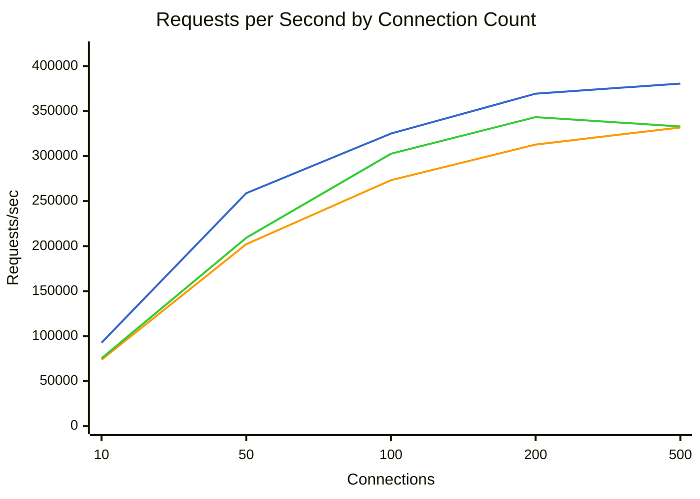
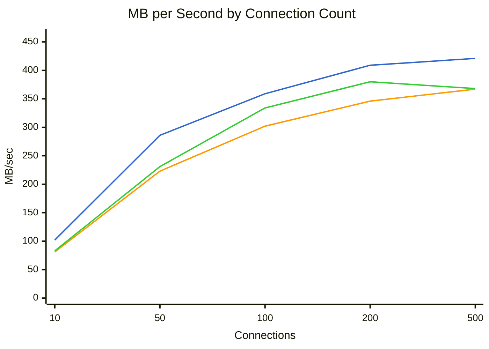
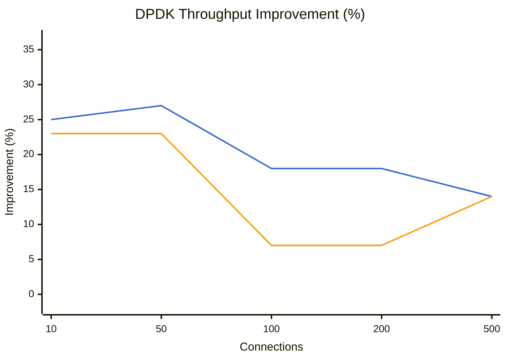
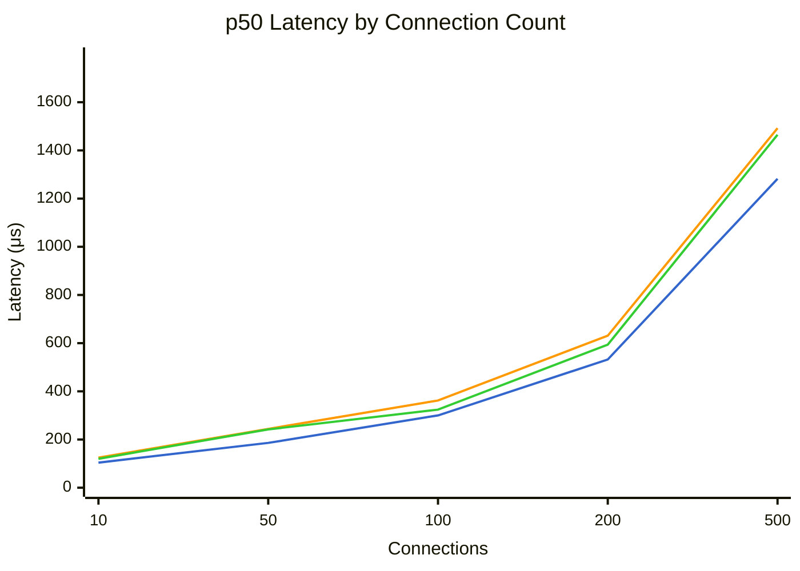
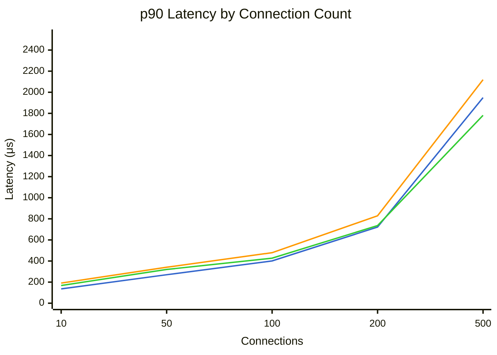
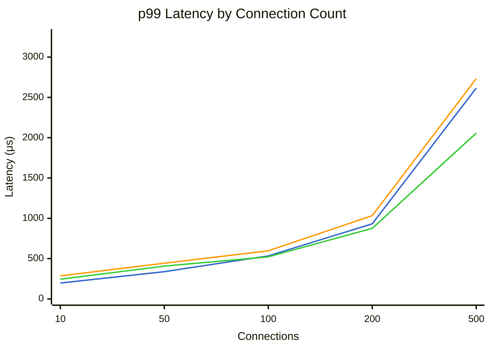

# Benchmark Comparison

Generated: 2026-01-25T10:32:47.658834

## Summary

| Mode | Connections | Requests/sec | MB/sec | p50 (μs) | p99 (μs) | Errors |
|------|-------------|--------------|--------|----------|----------|--------|
| dpdk | 10 | 92767 | 102.6 | 104 | 197 | 0 |
| dpdk | 50 | 258800 | 286.3 | 186 | 338 | 0 |
| dpdk | 100 | 325052 | 359.8 | 300 | 534 | 0 |
| dpdk | 200 | 369400 | 409.0 | 532 | 932 | 0 |
| dpdk | 500 | 380588 | 421.4 | 1282 | 2615 | 0 |
| tokio | 10 | 73850 | 81.6 | 125 | 286 | 0 |
| tokio | 50 | 202209 | 223.7 | 244 | 443 | 0 |
| tokio | 100 | 273226 | 302.3 | 362 | 597 | 0 |
| tokio | 200 | 312871 | 346.4 | 631 | 1033 | 0 |
| tokio | 500 | 331845 | 367.4 | 1492 | 2733 | 0 |
| tokio-local | 10 | 75414 | 83.4 | 120 | 245 | 0 |
| tokio-local | 50 | 209257 | 231.5 | 242 | 407 | 0 |
| tokio-local | 100 | 302620 | 334.9 | 324 | 522 | 0 |
| tokio-local | 200 | 343349 | 380.2 | 594 | 876 | 0 |
| tokio-local | 500 | 332944 | 368.6 | 1465 | 2057 | 0 |

## Throughput Comparison



**Legend:** dpdk (blue) | tokio (orange) | tokio-local (green)


## Bandwidth Comparison



**Legend:** dpdk (blue) | tokio (orange) | tokio-local (green)


## DPDK Throughput Improvement

Percentage improvement of DPDK over other modes (positive = DPDK is faster).



**Legend:** vs tokio (blue) | vs tokio-local (orange)


## Latency Comparison (p50)



**Legend:** dpdk (blue) | tokio (orange) | tokio-local (green)


## Latency Comparison (p90)



**Legend:** dpdk (blue) | tokio (orange) | tokio-local (green)


## Latency Comparison (p99)



**Legend:** dpdk (blue) | tokio (orange) | tokio-local (green)


## Raw Data

### dpdk

<details>
<summary>Click to expand</summary>

```json
{
  "benchmark_time": "2026-01-25T18:27:25+00:00",
  "results": [
    {
      "url": "http://10.0.0.5:8080/",
      "connections": 10,
      "duration_secs": 20.0,
      "mode": "raw",
      "worker_threads": 4,
      "timeout_ms": 5000,
      "requests": 1855339,
      "errors": 0,
      "gb_read": 2.0,
      "requests_per_sec": 92766.95,
      "mb_per_sec": 102.57,
      "latency": {
        "p50_us": 104,
        "p75_us": 118,
        "p90_us": 136,
        "p99_us": 197,
        "avg_us": 108,
        "max_us": 7299,
        "stdev_us": 36
      }
    },
    {
      "url": "http://10.0.0.5:8080/",
      "connections": 50,
      "duration_secs": 20.0,
      "mode": "raw",
      "worker_threads": 4,
      "timeout_ms": 5000,
      "requests": 5175991,
      "errors": 0,
      "gb_read": 5.59,
      "requests_per_sec": 258799.55,
      "mb_per_sec": 286.3,
      "latency": {
        "p50_us": 186,
        "p75_us": 230,
        "p90_us": 270,
        "p99_us": 338,
        "avg_us": 192,
        "max_us": 36511,
        "stdev_us": 101
      }
    },
    {
      "url": "http://10.0.0.5:8080/",
      "connections": 100,
      "duration_secs": 20.0,
      "mode": "raw",
      "worker_threads": 4,
      "timeout_ms": 5000,
      "requests": 6501035,
      "errors": 0,
      "gb_read": 7.03,
      "requests_per_sec": 325051.75,
      "mb_per_sec": 359.76,
      "latency": {
        "p50_us": 300,
        "p75_us": 351,
        "p90_us": 401,
        "p99_us": 534,
        "avg_us": 307,
        "max_us": 5867,
        "stdev_us": 107
      }
    },
    {
      "url": "http://10.0.0.5:8080/",
      "connections": 200,
      "duration_secs": 20.0,
      "mode": "raw",
      "worker_threads": 4,
      "timeout_ms": 5000,
      "requests": 7388001,
      "errors": 0,
      "gb_read": 7.99,
      "requests_per_sec": 369400.05,
      "mb_per_sec": 409.01,
      "latency": {
        "p50_us": 532,
        "p75_us": 629,
        "p90_us": 722,
        "p99_us": 932,
        "avg_us": 539,
        "max_us": 7771,
        "stdev_us": 154
      }
    },
    {
      "url": "http://10.0.0.5:8080/",
      "connections": 500,
      "duration_secs": 20.0,
      "mode": "raw",
      "worker_threads": 4,
      "timeout_ms": 5000,
      "requests": 7611763,
      "errors": 0,
      "gb_read": 8.23,
      "requests_per_sec": 380588.15,
      "mb_per_sec": 421.39,
      "latency": {
        "p50_us": 1282,
        "p75_us": 1625,
        "p90_us": 1949,
        "p99_us": 2615,
        "avg_us": 1310,
        "max_us": 16959,
        "stdev_us": 501
      }
    }
  ]
}
```

</details>

### tokio

<details>
<summary>Click to expand</summary>

```json
{
  "benchmark_time": "2026-01-25T18:29:56+00:00",
  "results": [
    {
      "url": "http://10.0.0.4:8080/",
      "connections": 10,
      "duration_secs": 20.0,
      "mode": "raw",
      "worker_threads": 4,
      "timeout_ms": 5000,
      "requests": 1476992,
      "errors": 0,
      "gb_read": 1.59,
      "requests_per_sec": 73849.6,
      "mb_per_sec": 81.64,
      "latency": {
        "p50_us": 125,
        "p75_us": 154,
        "p90_us": 191,
        "p99_us": 286,
        "avg_us": 134,
        "max_us": 4983,
        "stdev_us": 45
      }
    },
    {
      "url": "http://10.0.0.4:8080/",
      "connections": 50,
      "duration_secs": 20.0,
      "mode": "raw",
      "worker_threads": 4,
      "timeout_ms": 5000,
      "requests": 4044189,
      "errors": 0,
      "gb_read": 4.37,
      "requests_per_sec": 202209.45,
      "mb_per_sec": 223.7,
      "latency": {
        "p50_us": 244,
        "p75_us": 290,
        "p90_us": 341,
        "p99_us": 443,
        "avg_us": 244,
        "max_us": 6979,
        "stdev_us": 78
      }
    },
    {
      "url": "http://10.0.0.4:8080/",
      "connections": 100,
      "duration_secs": 20.0,
      "mode": "raw",
      "worker_threads": 4,
      "timeout_ms": 5000,
      "requests": 5464519,
      "errors": 0,
      "gb_read": 5.9,
      "requests_per_sec": 273225.95,
      "mb_per_sec": 302.31,
      "latency": {
        "p50_us": 362,
        "p75_us": 421,
        "p90_us": 479,
        "p99_us": 597,
        "avg_us": 365,
        "max_us": 209407,
        "stdev_us": 377
      }
    },
    {
      "url": "http://10.0.0.4:8080/",
      "connections": 200,
      "duration_secs": 20.0,
      "mode": "raw",
      "worker_threads": 4,
      "timeout_ms": 5000,
      "requests": 6257425,
      "errors": 0,
      "gb_read": 6.77,
      "requests_per_sec": 312871.25,
      "mb_per_sec": 346.42,
      "latency": {
        "p50_us": 631,
        "p75_us": 730,
        "p90_us": 829,
        "p99_us": 1033,
        "avg_us": 637,
        "max_us": 5595,
        "stdev_us": 152
      }
    },
    {
      "url": "http://10.0.0.4:8080/",
      "connections": 500,
      "duration_secs": 20.0,
      "mode": "raw",
      "worker_threads": 4,
      "timeout_ms": 5000,
      "requests": 6636902,
      "errors": 0,
      "gb_read": 7.18,
      "requests_per_sec": 331845.1,
      "mb_per_sec": 367.42,
      "latency": {
        "p50_us": 1492,
        "p75_us": 1816,
        "p90_us": 2119,
        "p99_us": 2733,
        "avg_us": 1503,
        "max_us": 26815,
        "stdev_us": 493
      }
    }
  ]
}
```

</details>

### tokio-local

<details>
<summary>Click to expand</summary>

```json
{
  "benchmark_time": "2026-01-25T18:32:27+00:00",
  "results": [
    {
      "url": "http://10.0.0.4:8080/",
      "connections": 10,
      "duration_secs": 20.0,
      "mode": "raw",
      "worker_threads": 4,
      "timeout_ms": 5000,
      "requests": 1508274,
      "errors": 0,
      "gb_read": 1.63,
      "requests_per_sec": 75413.7,
      "mb_per_sec": 83.37,
      "latency": {
        "p50_us": 120,
        "p75_us": 140,
        "p90_us": 168,
        "p99_us": 245,
        "avg_us": 126,
        "max_us": 7467,
        "stdev_us": 45
      }
    },
    {
      "url": "http://10.0.0.4:8080/",
      "connections": 50,
      "duration_secs": 20.0,
      "mode": "raw",
      "worker_threads": 4,
      "timeout_ms": 5000,
      "requests": 4185138,
      "errors": 0,
      "gb_read": 4.52,
      "requests_per_sec": 209256.9,
      "mb_per_sec": 231.49,
      "latency": {
        "p50_us": 242,
        "p75_us": 281,
        "p90_us": 320,
        "p99_us": 407,
        "avg_us": 237,
        "max_us": 7775,
        "stdev_us": 73
      }
    },
    {
      "url": "http://10.0.0.4:8080/",
      "connections": 100,
      "duration_secs": 20.0,
      "mode": "raw",
      "worker_threads": 4,
      "timeout_ms": 5000,
      "requests": 6052405,
      "errors": 0,
      "gb_read": 6.54,
      "requests_per_sec": 302620.25,
      "mb_per_sec": 334.86,
      "latency": {
        "p50_us": 324,
        "p75_us": 378,
        "p90_us": 427,
        "p99_us": 522,
        "avg_us": 328,
        "max_us": 2473,
        "stdev_us": 77
      }
    },
    {
      "url": "http://10.0.0.4:8080/",
      "connections": 200,
      "duration_secs": 20.0,
      "mode": "raw",
      "worker_threads": 4,
      "timeout_ms": 5000,
      "requests": 6866981,
      "errors": 0,
      "gb_read": 7.43,
      "requests_per_sec": 343349.05,
      "mb_per_sec": 380.16,
      "latency": {
        "p50_us": 594,
        "p75_us": 669,
        "p90_us": 736,
        "p99_us": 876,
        "avg_us": 588,
        "max_us": 8415,
        "stdev_us": 130
      }
    },
    {
      "url": "http://10.0.0.4:8080/",
      "connections": 500,
      "duration_secs": 20.0,
      "mode": "raw",
      "worker_threads": 4,
      "timeout_ms": 5000,
      "requests": 6658878,
      "errors": 0,
      "gb_read": 7.2,
      "requests_per_sec": 332943.9,
      "mb_per_sec": 368.64,
      "latency": {
        "p50_us": 1465,
        "p75_us": 1629,
        "p90_us": 1781,
        "p99_us": 2057,
        "avg_us": 1481,
        "max_us": 23247,
        "stdev_us": 248
      }
    }
  ]
}
```

</details>
