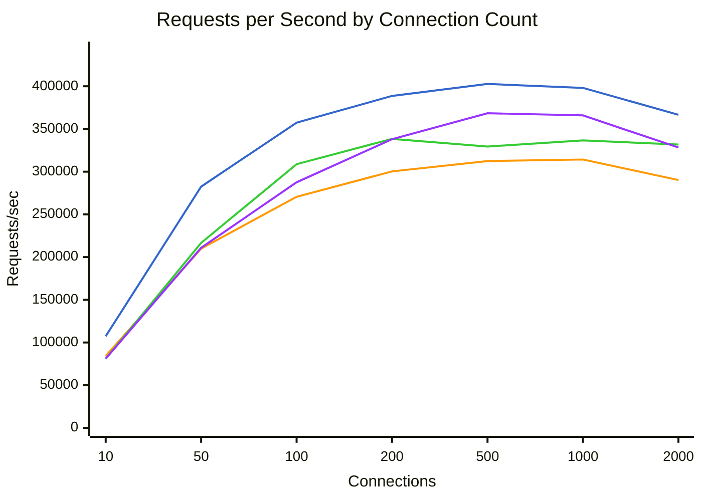
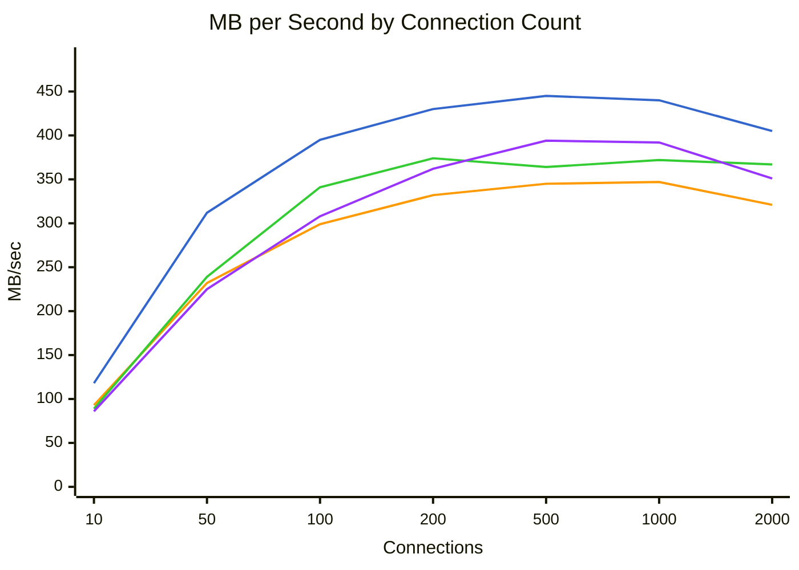
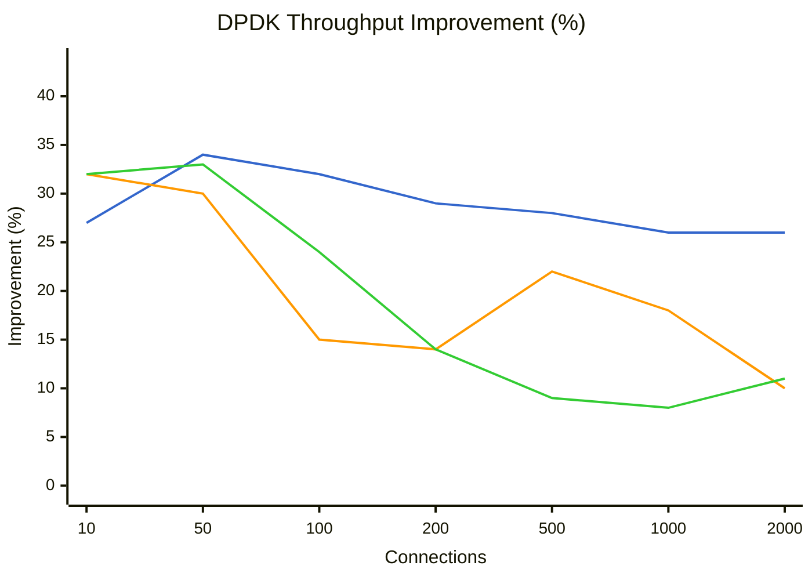
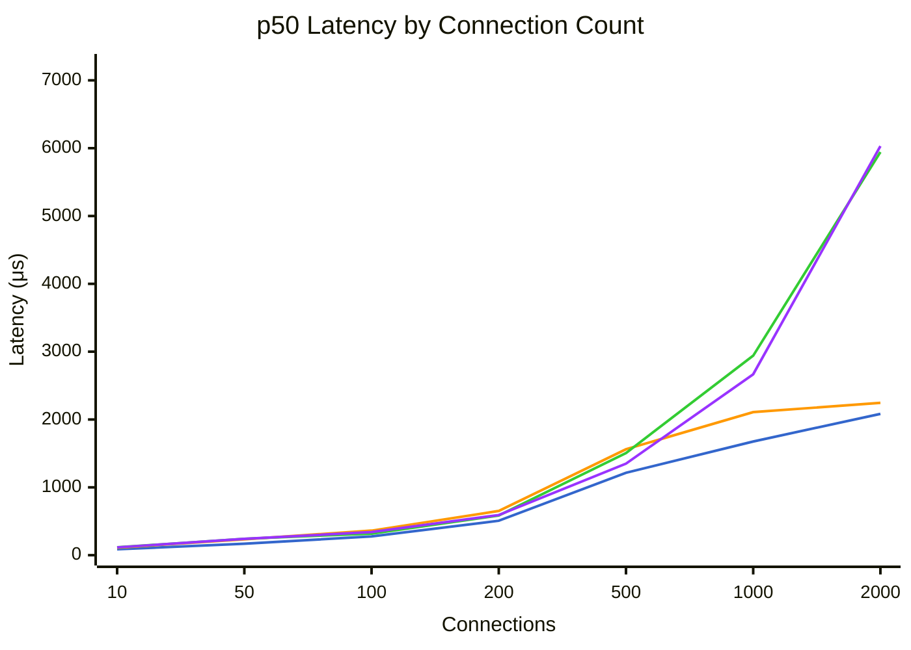
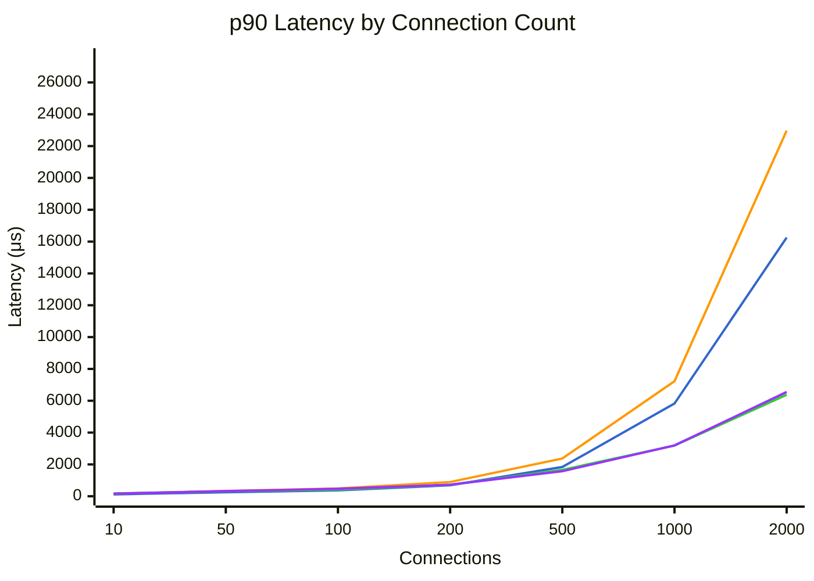
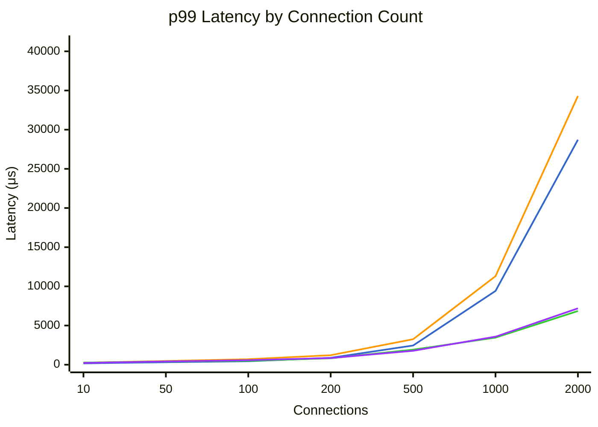

# Benchmark Comparison

Generated: 2026-01-28T22:39:03.285359

## Summary

| Mode | Connections | Requests/sec | MB/sec | p50 (μs) | p99 (μs) | Errors |
|------|-------------|--------------|--------|----------|----------|--------|
| dpdk | 10 | 107317 | 118.7 | 87 | 173 | 0 |
| dpdk | 50 | 282510 | 312.5 | 169 | 317 | 0 |
| dpdk | 100 | 357437 | 395.6 | 276 | 442 | 0 |
| dpdk | 200 | 388703 | 430.4 | 508 | 877 | 0 |
| dpdk | 500 | 402741 | 445.9 | 1214 | 2449 | 0 |
| dpdk | 1000 | 398109 | 440.8 | 1676 | 9415 | 0 |
| dpdk | 2000 | 366645 | 405.9 | 2083 | 28719 | 0 |
| tokio | 10 | 84173 | 93.1 | 109 | 248 | 0 |
| tokio | 50 | 209956 | 232.3 | 234 | 476 | 0 |
| tokio | 100 | 270598 | 299.4 | 362 | 702 | 0 |
| tokio | 200 | 300315 | 332.5 | 652 | 1213 | 0 |
| tokio | 500 | 312454 | 345.9 | 1561 | 3249 | 0 |
| tokio | 1000 | 314251 | 347.9 | 2109 | 11303 | 0 |
| tokio | 2000 | 290236 | 321.4 | 2245 | 34303 | 0 |
| tokio-local | 10 | 80957 | 89.5 | 116 | 268 | 0 |
| tokio-local | 50 | 216641 | 239.7 | 242 | 401 | 0 |
| tokio-local | 100 | 308778 | 341.7 | 318 | 501 | 0 |
| tokio-local | 200 | 338424 | 374.7 | 585 | 823 | 0 |
| tokio-local | 500 | 329479 | 364.8 | 1506 | 1914 | 0 |
| tokio-local | 1000 | 336595 | 372.7 | 2941 | 3463 | 0 |
| tokio-local | 2000 | 331776 | 367.4 | 5943 | 6847 | 0 |
| kimojio | 10 | 81030 | 86.7 | 115 | 226 | 0 |
| kimojio | 50 | 210881 | 225.8 | 240 | 414 | 0 |
| kimojio | 100 | 287580 | 308.1 | 341 | 575 | 0 |
| kimojio | 200 | 338068 | 362.4 | 592 | 856 | 0 |
| kimojio | 500 | 368437 | 394.9 | 1349 | 1781 | 0 |
| kimojio | 1000 | 365898 | 392.2 | 2667 | 3575 | 0 |
| kimojio | 2000 | 328267 | 351.9 | 6031 | 7195 | 0 |

## Throughput Comparison



**Legend:** dpdk (blue) | tokio (orange) | tokio-local (green) | kimojio (purple)


## Bandwidth Comparison



**Legend:** dpdk (blue) | tokio (orange) | tokio-local (green) | kimojio (purple)


## DPDK Throughput Improvement

Percentage improvement of DPDK over other modes (positive = DPDK is faster).



**Legend:** vs tokio (blue) | vs tokio-local (orange) | vs kimojio (green)


## Latency Comparison (p50)



**Legend:** dpdk (blue) | tokio (orange) | tokio-local (green) | kimojio (purple)


## Latency Comparison (p90)



**Legend:** dpdk (blue) | tokio (orange) | tokio-local (green) | kimojio (purple)


## Latency Comparison (p99)



**Legend:** dpdk (blue) | tokio (orange) | tokio-local (green) | kimojio (purple)


## Raw Data

### dpdk

<details>
<summary>Click to expand</summary>

```json
{
  "benchmark_time": "2026-01-29T06:28:45+00:00",
  "results": [
    {
      "url": "http://10.0.0.5:8080/",
      "connections": 10,
      "duration_secs": 20.0,
      "mode": "raw",
      "worker_threads": 4,
      "timeout_ms": 5000,
      "requests": 2146333,
      "errors": 0,
      "gb_read": 2.32,
      "requests_per_sec": 107316.65,
      "mb_per_sec": 118.67,
      "latency": {
        "p50_us": 87,
        "p75_us": 99,
        "p90_us": 117,
        "p99_us": 173,
        "avg_us": 91,
        "max_us": 8631,
        "stdev_us": 31
      }
    },
    {
      "url": "http://10.0.0.5:8080/",
      "connections": 50,
      "duration_secs": 20.0,
      "mode": "raw",
      "worker_threads": 4,
      "timeout_ms": 5000,
      "requests": 5650205,
      "errors": 0,
      "gb_read": 6.1,
      "requests_per_sec": 282510.25,
      "mb_per_sec": 312.53,
      "latency": {
        "p50_us": 169,
        "p75_us": 212,
        "p90_us": 252,
        "p99_us": 317,
        "avg_us": 175,
        "max_us": 47135,
        "stdev_us": 66
      }
    },
    {
      "url": "http://10.0.0.5:8080/",
      "connections": 100,
      "duration_secs": 20.0,
      "mode": "raw",
      "worker_threads": 4,
      "timeout_ms": 5000,
      "requests": 7148733,
      "errors": 0,
      "gb_read": 7.73,
      "requests_per_sec": 357436.65,
      "mb_per_sec": 395.65,
      "latency": {
        "p50_us": 276,
        "p75_us": 321,
        "p90_us": 365,
        "p99_us": 442,
        "avg_us": 278,
        "max_us": 8091,
        "stdev_us": 77
      }
    },
    {
      "url": "http://10.0.0.5:8080/",
      "connections": 200,
      "duration_secs": 20.0,
      "mode": "raw",
      "worker_threads": 4,
      "timeout_ms": 5000,
      "requests": 7774052,
      "errors": 0,
      "gb_read": 8.41,
      "requests_per_sec": 388702.6,
      "mb_per_sec": 430.38,
      "latency": {
        "p50_us": 508,
        "p75_us": 599,
        "p90_us": 689,
        "p99_us": 877,
        "avg_us": 513,
        "max_us": 5351,
        "stdev_us": 139
      }
    },
    {
      "url": "http://10.0.0.5:8080/",
      "connections": 500,
      "duration_secs": 20.0,
      "mode": "raw",
      "worker_threads": 4,
      "timeout_ms": 5000,
      "requests": 8054816,
      "errors": 0,
      "gb_read": 8.71,
      "requests_per_sec": 402740.8,
      "mb_per_sec": 445.92,
      "latency": {
        "p50_us": 1214,
        "p75_us": 1533,
        "p90_us": 1836,
        "p99_us": 2449,
        "avg_us": 1239,
        "max_us": 35679,
        "stdev_us": 468
      }
    },
    {
      "url": "http://10.0.0.5:8080/",
      "connections": 1000,
      "duration_secs": 20.0,
      "mode": "raw",
      "worker_threads": 4,
      "timeout_ms": 5000,
      "requests": 7962185,
      "errors": 0,
      "gb_read": 8.61,
      "requests_per_sec": 398109.25,
      "mb_per_sec": 440.79,
      "latency": {
        "p50_us": 1676,
        "p75_us": 2527,
        "p90_us": 5827,
        "p99_us": 9415,
        "avg_us": 2504,
        "max_us": 43263,
        "stdev_us": 2091
      }
    },
    {
      "url": "http://10.0.0.5:8080/",
      "connections": 2000,
      "duration_secs": 20.0,
      "mode": "raw",
      "worker_threads": 4,
      "timeout_ms": 5000,
      "requests": 7332891,
      "errors": 0,
      "gb_read": 7.93,
      "requests_per_sec": 366644.55,
      "mb_per_sec": 405.95,
      "latency": {
        "p50_us": 2083,
        "p75_us": 3355,
        "p90_us": 16255,
        "p99_us": 28719,
        "avg_us": 5428,
        "max_us": 90047,
        "stdev_us": 6805
      }
    }
  ]
}
```

</details>

### tokio

<details>
<summary>Click to expand</summary>

```json
{
  "benchmark_time": "2026-01-29T06:32:04+00:00",
  "results": [
    {
      "url": "http://10.0.0.4:8080/",
      "connections": 10,
      "duration_secs": 20.0,
      "mode": "raw",
      "worker_threads": 4,
      "timeout_ms": 5000,
      "requests": 1683464,
      "errors": 0,
      "gb_read": 1.82,
      "requests_per_sec": 84173.2,
      "mb_per_sec": 93.06,
      "latency": {
        "p50_us": 109,
        "p75_us": 132,
        "p90_us": 163,
        "p99_us": 248,
        "avg_us": 116,
        "max_us": 2399,
        "stdev_us": 37
      }
    },
    {
      "url": "http://10.0.0.4:8080/",
      "connections": 50,
      "duration_secs": 20.0,
      "mode": "raw",
      "worker_threads": 4,
      "timeout_ms": 5000,
      "requests": 4199113,
      "errors": 0,
      "gb_read": 4.54,
      "requests_per_sec": 209955.65,
      "mb_per_sec": 232.27,
      "latency": {
        "p50_us": 234,
        "p75_us": 281,
        "p90_us": 333,
        "p99_us": 476,
        "avg_us": 237,
        "max_us": 7179,
        "stdev_us": 84
      }
    },
    {
      "url": "http://10.0.0.4:8080/",
      "connections": 100,
      "duration_secs": 20.0,
      "mode": "raw",
      "worker_threads": 4,
      "timeout_ms": 5000,
      "requests": 5411960,
      "errors": 0,
      "gb_read": 5.85,
      "requests_per_sec": 270598.0,
      "mb_per_sec": 299.41,
      "latency": {
        "p50_us": 362,
        "p75_us": 423,
        "p90_us": 492,
        "p99_us": 702,
        "avg_us": 369,
        "max_us": 7355,
        "stdev_us": 107
      }
    },
    {
      "url": "http://10.0.0.4:8080/",
      "connections": 200,
      "duration_secs": 20.0,
      "mode": "raw",
      "worker_threads": 4,
      "timeout_ms": 5000,
      "requests": 6006307,
      "errors": 0,
      "gb_read": 6.49,
      "requests_per_sec": 300315.35,
      "mb_per_sec": 332.51,
      "latency": {
        "p50_us": 652,
        "p75_us": 771,
        "p90_us": 894,
        "p99_us": 1213,
        "avg_us": 664,
        "max_us": 6019,
        "stdev_us": 190
      }
    },
    {
      "url": "http://10.0.0.4:8080/",
      "connections": 500,
      "duration_secs": 20.0,
      "mode": "raw",
      "worker_threads": 4,
      "timeout_ms": 5000,
      "requests": 6249090,
      "errors": 0,
      "gb_read": 6.76,
      "requests_per_sec": 312454.5,
      "mb_per_sec": 345.95,
      "latency": {
        "p50_us": 1561,
        "p75_us": 1984,
        "p90_us": 2371,
        "p99_us": 3249,
        "avg_us": 1596,
        "max_us": 205439,
        "stdev_us": 633
      }
    },
    {
      "url": "http://10.0.0.4:8080/",
      "connections": 1000,
      "duration_secs": 20.0,
      "mode": "raw",
      "worker_threads": 4,
      "timeout_ms": 5000,
      "requests": 6285016,
      "errors": 0,
      "gb_read": 6.8,
      "requests_per_sec": 314250.8,
      "mb_per_sec": 347.94,
      "latency": {
        "p50_us": 2109,
        "p75_us": 4091,
        "p90_us": 7227,
        "p99_us": 11303,
        "avg_us": 3172,
        "max_us": 47711,
        "stdev_us": 2560
      }
    },
    {
      "url": "http://10.0.0.4:8080/",
      "connections": 2000,
      "duration_secs": 20.0,
      "mode": "raw",
      "worker_threads": 4,
      "timeout_ms": 5000,
      "requests": 5804720,
      "errors": 0,
      "gb_read": 6.28,
      "requests_per_sec": 290236.0,
      "mb_per_sec": 321.35,
      "latency": {
        "p50_us": 2245,
        "p75_us": 3431,
        "p90_us": 22975,
        "p99_us": 34303,
        "avg_us": 6850,
        "max_us": 94079,
        "stdev_us": 9366
      }
    }
  ]
}
```

</details>

### tokio-local

<details>
<summary>Click to expand</summary>

```json
{
  "benchmark_time": "2026-01-29T06:35:22+00:00",
  "results": [
    {
      "url": "http://10.0.0.4:8080/",
      "connections": 10,
      "duration_secs": 20.0,
      "mode": "raw",
      "worker_threads": 4,
      "timeout_ms": 5000,
      "requests": 1619142,
      "errors": 0,
      "gb_read": 1.75,
      "requests_per_sec": 80957.1,
      "mb_per_sec": 89.51,
      "latency": {
        "p50_us": 116,
        "p75_us": 145,
        "p90_us": 179,
        "p99_us": 268,
        "avg_us": 125,
        "max_us": 993,
        "stdev_us": 41
      }
    },
    {
      "url": "http://10.0.0.4:8080/",
      "connections": 50,
      "duration_secs": 20.0,
      "mode": "raw",
      "worker_threads": 4,
      "timeout_ms": 5000,
      "requests": 4332823,
      "errors": 0,
      "gb_read": 4.68,
      "requests_per_sec": 216641.15,
      "mb_per_sec": 239.66,
      "latency": {
        "p50_us": 242,
        "p75_us": 279,
        "p90_us": 313,
        "p99_us": 401,
        "avg_us": 235,
        "max_us": 4931,
        "stdev_us": 68
      }
    },
    {
      "url": "http://10.0.0.4:8080/",
      "connections": 100,
      "duration_secs": 20.0,
      "mode": "raw",
      "worker_threads": 4,
      "timeout_ms": 5000,
      "requests": 6175559,
      "errors": 0,
      "gb_read": 6.67,
      "requests_per_sec": 308777.95,
      "mb_per_sec": 341.69,
      "latency": {
        "p50_us": 318,
        "p75_us": 371,
        "p90_us": 417,
        "p99_us": 501,
        "avg_us": 322,
        "max_us": 2043,
        "stdev_us": 73
      }
    },
    {
      "url": "http://10.0.0.4:8080/",
      "connections": 200,
      "duration_secs": 20.0,
      "mode": "raw",
      "worker_threads": 4,
      "timeout_ms": 5000,
      "requests": 6768475,
      "errors": 0,
      "gb_read": 7.32,
      "requests_per_sec": 338423.75,
      "mb_per_sec": 374.71,
      "latency": {
        "p50_us": 585,
        "p75_us": 658,
        "p90_us": 716,
        "p99_us": 823,
        "avg_us": 584,
        "max_us": 207999,
        "stdev_us": 156
      }
    },
    {
      "url": "http://10.0.0.4:8080/",
      "connections": 500,
      "duration_secs": 20.0,
      "mode": "raw",
      "worker_threads": 4,
      "timeout_ms": 5000,
      "requests": 6589581,
      "errors": 0,
      "gb_read": 7.13,
      "requests_per_sec": 329479.05,
      "mb_per_sec": 364.8,
      "latency": {
        "p50_us": 1506,
        "p75_us": 1587,
        "p90_us": 1655,
        "p99_us": 1914,
        "avg_us": 1509,
        "max_us": 17215,
        "stdev_us": 152
      }
    },
    {
      "url": "http://10.0.0.4:8080/",
      "connections": 1000,
      "duration_secs": 20.0,
      "mode": "raw",
      "worker_threads": 4,
      "timeout_ms": 5000,
      "requests": 6731895,
      "errors": 0,
      "gb_read": 7.28,
      "requests_per_sec": 336594.75,
      "mb_per_sec": 372.68,
      "latency": {
        "p50_us": 2941,
        "p75_us": 3065,
        "p90_us": 3185,
        "p99_us": 3463,
        "avg_us": 2958,
        "max_us": 28367,
        "stdev_us": 272
      }
    },
    {
      "url": "http://10.0.0.4:8080/",
      "connections": 2000,
      "duration_secs": 20.0,
      "mode": "raw",
      "worker_threads": 4,
      "timeout_ms": 5000,
      "requests": 6635525,
      "errors": 0,
      "gb_read": 7.17,
      "requests_per_sec": 331776.25,
      "mb_per_sec": 367.35,
      "latency": {
        "p50_us": 5943,
        "p75_us": 6175,
        "p90_us": 6379,
        "p99_us": 6847,
        "avg_us": 5994,
        "max_us": 65471,
        "stdev_us": 774
      }
    }
  ]
}
```

</details>

### kimojio

<details>
<summary>Click to expand</summary>

```json
{
  "benchmark_time": "2026-01-29T06:38:41+00:00",
  "results": [
    {
      "url": "http://10.0.0.4:8080/",
      "connections": 10,
      "duration_secs": 20.0,
      "mode": "raw",
      "worker_threads": 4,
      "timeout_ms": 5000,
      "requests": 1620592,
      "errors": 0,
      "gb_read": 1.69,
      "requests_per_sec": 81029.6,
      "mb_per_sec": 86.73,
      "latency": {
        "p50_us": 115,
        "p75_us": 133,
        "p90_us": 156,
        "p99_us": 226,
        "avg_us": 119,
        "max_us": 12599,
        "stdev_us": 44
      }
    },
    {
      "url": "http://10.0.0.4:8080/",
      "connections": 50,
      "duration_secs": 20.0,
      "mode": "raw",
      "worker_threads": 4,
      "timeout_ms": 5000,
      "requests": 4217611,
      "errors": 0,
      "gb_read": 4.41,
      "requests_per_sec": 210880.55,
      "mb_per_sec": 225.85,
      "latency": {
        "p50_us": 240,
        "p75_us": 281,
        "p90_us": 321,
        "p99_us": 414,
        "avg_us": 236,
        "max_us": 12983,
        "stdev_us": 80
      }
    },
    {
      "url": "http://10.0.0.4:8080/",
      "connections": 100,
      "duration_secs": 20.0,
      "mode": "raw",
      "worker_threads": 4,
      "timeout_ms": 5000,
      "requests": 5751602,
      "errors": 0,
      "gb_read": 6.02,
      "requests_per_sec": 287580.1,
      "mb_per_sec": 308.07,
      "latency": {
        "p50_us": 341,
        "p75_us": 409,
        "p90_us": 469,
        "p99_us": 575,
        "avg_us": 346,
        "max_us": 2625,
        "stdev_us": 92
      }
    },
    {
      "url": "http://10.0.0.4:8080/",
      "connections": 200,
      "duration_secs": 20.0,
      "mode": "raw",
      "worker_threads": 4,
      "timeout_ms": 5000,
      "requests": 6761356,
      "errors": 0,
      "gb_read": 7.08,
      "requests_per_sec": 338067.8,
      "mb_per_sec": 362.38,
      "latency": {
        "p50_us": 592,
        "p75_us": 661,
        "p90_us": 725,
        "p99_us": 856,
        "avg_us": 595,
        "max_us": 9567,
        "stdev_us": 123
      }
    },
    {
      "url": "http://10.0.0.4:8080/",
      "connections": 500,
      "duration_secs": 20.0,
      "mode": "raw",
      "worker_threads": 4,
      "timeout_ms": 5000,
      "requests": 7368739,
      "errors": 0,
      "gb_read": 7.71,
      "requests_per_sec": 368436.95,
      "mb_per_sec": 394.94,
      "latency": {
        "p50_us": 1349,
        "p75_us": 1464,
        "p90_us": 1571,
        "p99_us": 1781,
        "avg_us": 1351,
        "max_us": 206207,
        "stdev_us": 240
      }
    },
    {
      "url": "http://10.0.0.4:8080/",
      "connections": 1000,
      "duration_secs": 20.0,
      "mode": "raw",
      "worker_threads": 4,
      "timeout_ms": 5000,
      "requests": 7317963,
      "errors": 0,
      "gb_read": 7.66,
      "requests_per_sec": 365898.15,
      "mb_per_sec": 392.22,
      "latency": {
        "p50_us": 2667,
        "p75_us": 2911,
        "p90_us": 3193,
        "p99_us": 3575,
        "avg_us": 2730,
        "max_us": 52703,
        "stdev_us": 382
      }
    },
    {
      "url": "http://10.0.0.4:8080/",
      "connections": 2000,
      "duration_secs": 20.0,
      "mode": "raw",
      "worker_threads": 4,
      "timeout_ms": 5000,
      "requests": 6565343,
      "errors": 0,
      "gb_read": 6.87,
      "requests_per_sec": 328267.15,
      "mb_per_sec": 351.88,
      "latency": {
        "p50_us": 6031,
        "p75_us": 6287,
        "p90_us": 6551,
        "p99_us": 7195,
        "avg_us": 6061,
        "max_us": 212479,
        "stdev_us": 831
      }
    }
  ]
}
```

</details>
