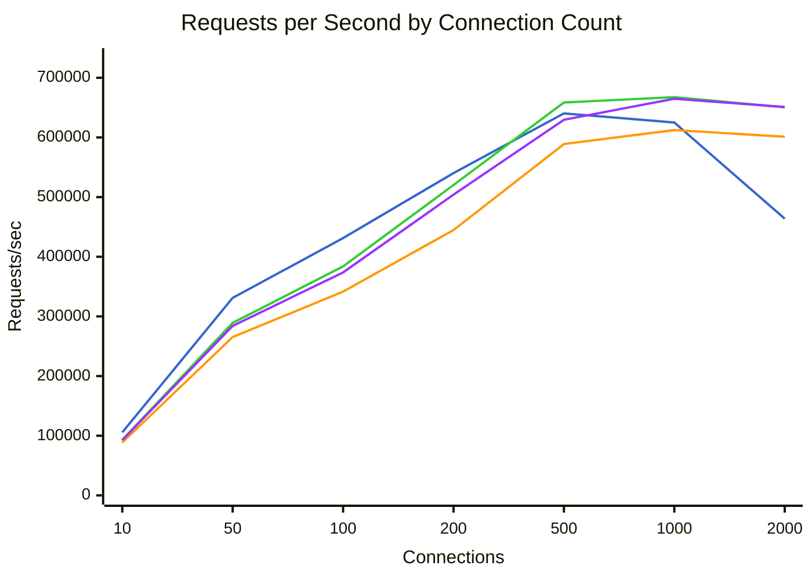
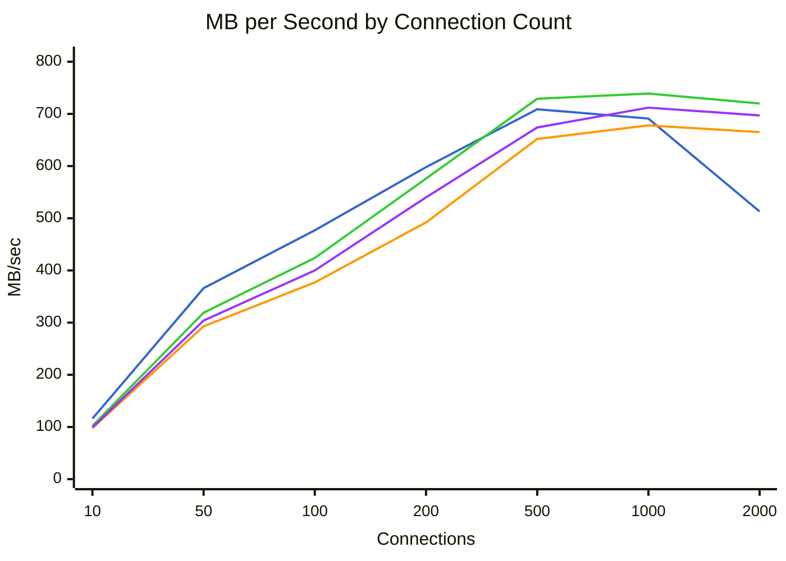
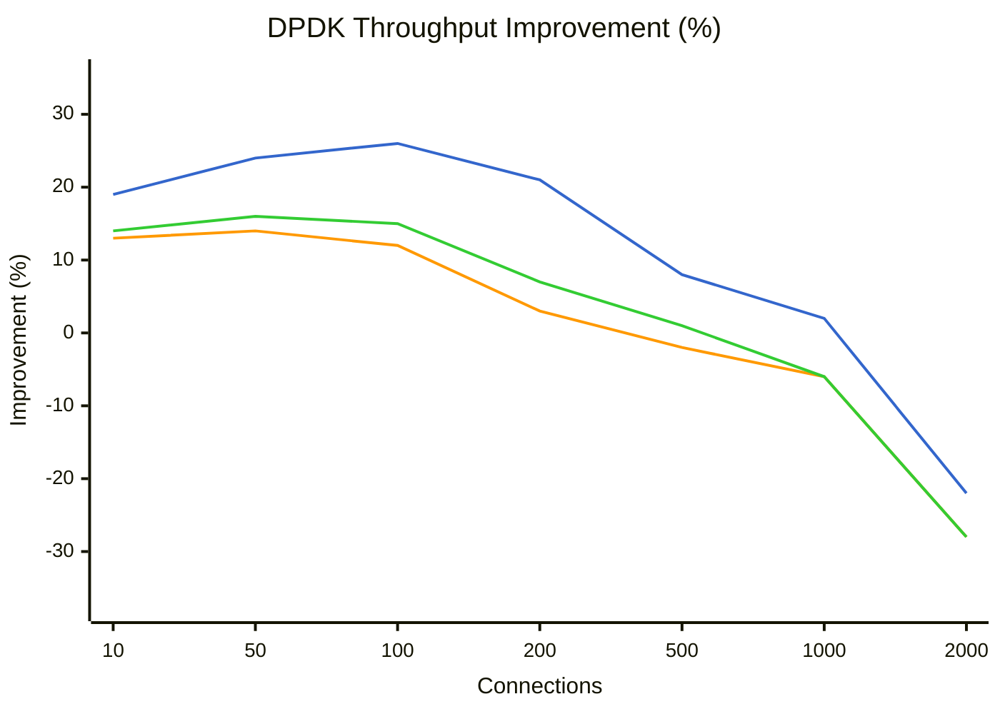
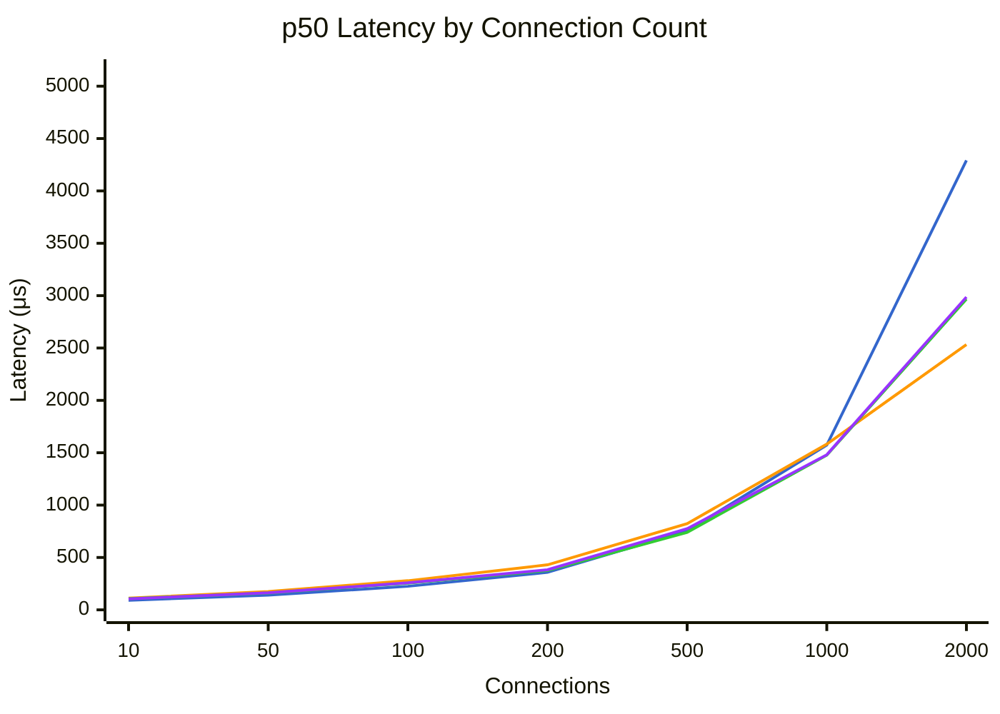
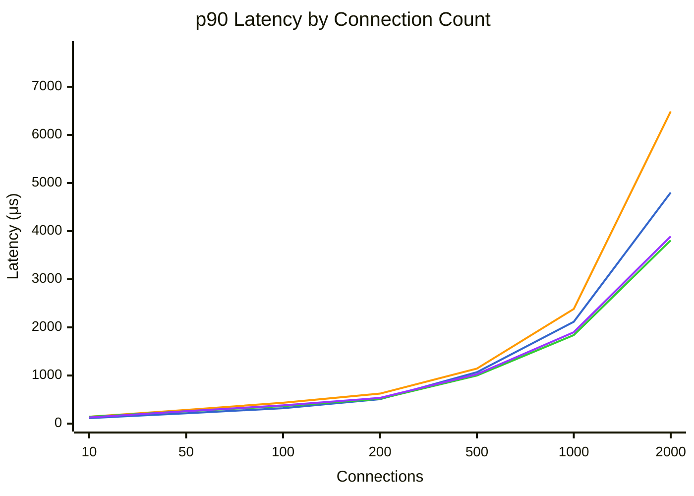
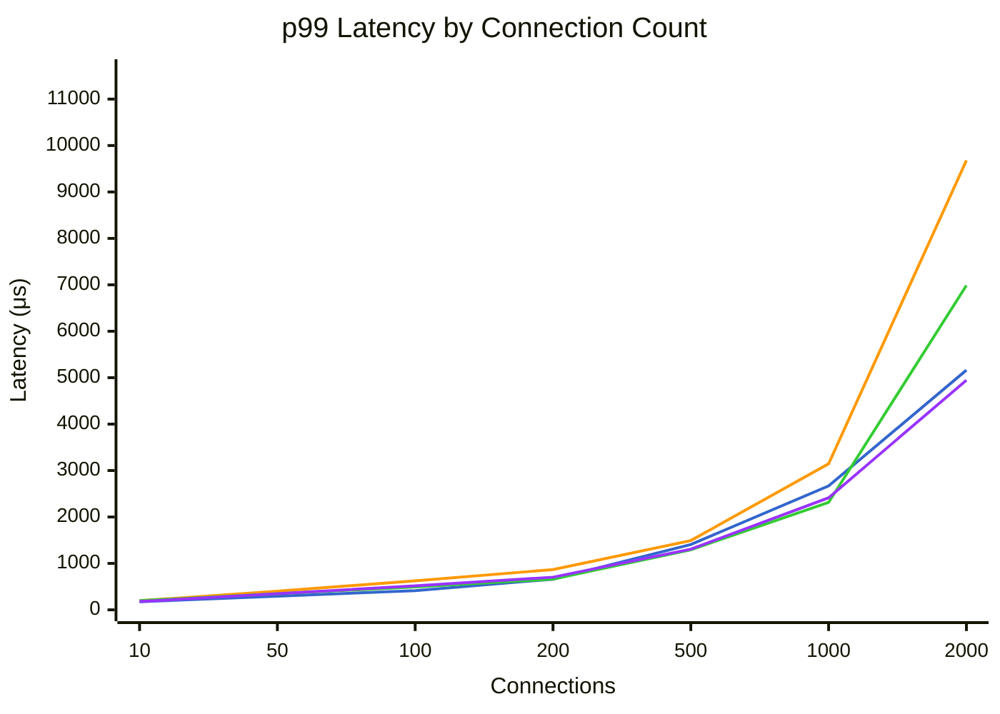

# Benchmark Comparison

Generated: 2026-01-28T22:56:38.750398

## Summary

| Mode | Connections | Requests/sec | MB/sec | p50 (μs) | p99 (μs) | Errors |
|------|-------------|--------------|--------|----------|----------|--------|
| dpdk | 10 | 105692 | 116.9 | 91 | 175 | 0 |
| dpdk | 50 | 331041 | 366.2 | 140 | 295 | 0 |
| dpdk | 100 | 431218 | 477.4 | 225 | 412 | 0 |
| dpdk | 200 | 540209 | 598.1 | 358 | 660 | 0 |
| dpdk | 500 | 640375 | 709.0 | 754 | 1408 | 0 |
| dpdk | 1000 | 624960 | 692.0 | 1573 | 2669 | 0 |
| dpdk | 2000 | 463950 | 513.7 | 4291 | 5163 | 0 |
| tokio | 10 | 88744 | 98.1 | 111 | 197 | 0 |
| tokio | 50 | 265396 | 293.6 | 174 | 401 | 0 |
| tokio | 100 | 341516 | 378.0 | 278 | 624 | 0 |
| tokio | 200 | 444694 | 492.4 | 430 | 867 | 0 |
| tokio | 500 | 588942 | 652.1 | 823 | 1492 | 0 |
| tokio | 1000 | 612376 | 678.0 | 1582 | 3147 | 0 |
| tokio | 2000 | 601134 | 665.6 | 2533 | 9679 | 0 |
| tokio-local | 10 | 92993 | 102.8 | 106 | 197 | 0 |
| tokio-local | 50 | 289220 | 319.9 | 161 | 347 | 0 |
| tokio-local | 100 | 383831 | 424.9 | 255 | 492 | 0 |
| tokio-local | 200 | 520223 | 576.0 | 376 | 662 | 0 |
| tokio-local | 500 | 658556 | 729.2 | 740 | 1294 | 0 |
| tokio-local | 1000 | 667501 | 739.1 | 1477 | 2313 | 0 |
| tokio-local | 2000 | 650540 | 720.3 | 2967 | 6987 | 0 |
| kimojio | 10 | 92560 | 99.1 | 105 | 178 | 0 |
| kimojio | 50 | 284066 | 304.2 | 163 | 349 | 0 |
| kimojio | 100 | 373738 | 400.5 | 258 | 517 | 0 |
| kimojio | 200 | 504026 | 540.3 | 383 | 703 | 0 |
| kimojio | 500 | 629569 | 674.9 | 775 | 1307 | 0 |
| kimojio | 1000 | 664897 | 712.7 | 1481 | 2413 | 0 |
| kimojio | 2000 | 650940 | 697.8 | 2987 | 4947 | 0 |

## Throughput Comparison



**Legend:** dpdk (blue) | tokio (orange) | tokio-local (green) | kimojio (purple)


## Bandwidth Comparison



**Legend:** dpdk (blue) | tokio (orange) | tokio-local (green) | kimojio (purple)


## DPDK Throughput Improvement

Percentage improvement of DPDK over other modes (positive = DPDK is faster).



**Legend:** vs tokio (blue) | vs tokio-local (orange) | vs kimojio (green)


## Latency Comparison (p50)



**Legend:** dpdk (blue) | tokio (orange) | tokio-local (green) | kimojio (purple)


## Latency Comparison (p90)



**Legend:** dpdk (blue) | tokio (orange) | tokio-local (green) | kimojio (purple)


## Latency Comparison (p99)



**Legend:** dpdk (blue) | tokio (orange) | tokio-local (green) | kimojio (purple)


## Raw Data

### dpdk

<details>
<summary>Click to expand</summary>

```json
{
  "benchmark_time": "2026-01-29T06:46:21+00:00",
  "results": [
    {
      "url": "http://10.0.0.5:8080/",
      "connections": 10,
      "duration_secs": 20.0,
      "mode": "raw",
      "worker_threads": 8,
      "timeout_ms": 5000,
      "requests": 2113837,
      "errors": 0,
      "gb_read": 2.28,
      "requests_per_sec": 105691.85,
      "mb_per_sec": 116.87,
      "latency": {
        "p50_us": 91,
        "p75_us": 102,
        "p90_us": 115,
        "p99_us": 175,
        "avg_us": 93,
        "max_us": 39103,
        "stdev_us": 49
      }
    },
    {
      "url": "http://10.0.0.5:8080/",
      "connections": 50,
      "duration_secs": 20.0,
      "mode": "raw",
      "worker_threads": 8,
      "timeout_ms": 5000,
      "requests": 6620819,
      "errors": 0,
      "gb_read": 7.15,
      "requests_per_sec": 331040.95,
      "mb_per_sec": 366.22,
      "latency": {
        "p50_us": 140,
        "p75_us": 175,
        "p90_us": 215,
        "p99_us": 295,
        "avg_us": 151,
        "max_us": 207615,
        "stdev_us": 737
      }
    },
    {
      "url": "http://10.0.0.5:8080/",
      "connections": 100,
      "duration_secs": 20.0,
      "mode": "raw",
      "worker_threads": 8,
      "timeout_ms": 5000,
      "requests": 8624366,
      "errors": 0,
      "gb_read": 9.32,
      "requests_per_sec": 431218.3,
      "mb_per_sec": 477.39,
      "latency": {
        "p50_us": 225,
        "p75_us": 273,
        "p90_us": 320,
        "p99_us": 412,
        "avg_us": 231,
        "max_us": 208383,
        "stdev_us": 626
      }
    },
    {
      "url": "http://10.0.0.5:8080/",
      "connections": 200,
      "duration_secs": 20.0,
      "mode": "raw",
      "worker_threads": 8,
      "timeout_ms": 5000,
      "requests": 10804181,
      "errors": 0,
      "gb_read": 11.68,
      "requests_per_sec": 540209.05,
      "mb_per_sec": 598.13,
      "latency": {
        "p50_us": 358,
        "p75_us": 432,
        "p90_us": 509,
        "p99_us": 660,
        "avg_us": 368,
        "max_us": 204031,
        "stdev_us": 172
      }
    },
    {
      "url": "http://10.0.0.5:8080/",
      "connections": 500,
      "duration_secs": 20.0,
      "mode": "raw",
      "worker_threads": 8,
      "timeout_ms": 5000,
      "requests": 12807496,
      "errors": 0,
      "gb_read": 13.85,
      "requests_per_sec": 640374.8,
      "mb_per_sec": 709.03,
      "latency": {
        "p50_us": 754,
        "p75_us": 908,
        "p90_us": 1068,
        "p99_us": 1408,
        "avg_us": 774,
        "max_us": 11079,
        "stdev_us": 233
      }
    },
    {
      "url": "http://10.0.0.5:8080/",
      "connections": 1000,
      "duration_secs": 20.0,
      "mode": "raw",
      "worker_threads": 8,
      "timeout_ms": 5000,
      "requests": 12499196,
      "errors": 0,
      "gb_read": 13.51,
      "requests_per_sec": 624959.8,
      "mb_per_sec": 691.97,
      "latency": {
        "p50_us": 1573,
        "p75_us": 1858,
        "p90_us": 2117,
        "p99_us": 2669,
        "avg_us": 1592,
        "max_us": 23967,
        "stdev_us": 427
      }
    },
    {
      "url": "http://10.0.0.5:8080/",
      "connections": 2000,
      "duration_secs": 20.0,
      "mode": "raw",
      "worker_threads": 8,
      "timeout_ms": 5000,
      "requests": 9279003,
      "errors": 0,
      "gb_read": 10.03,
      "requests_per_sec": 463950.15,
      "mb_per_sec": 513.69,
      "latency": {
        "p50_us": 4291,
        "p75_us": 4571,
        "p90_us": 4803,
        "p99_us": 5163,
        "avg_us": 4296,
        "max_us": 215551,
        "stdev_us": 608
      }
    }
  ]
}
```

</details>

### tokio

<details>
<summary>Click to expand</summary>

```json
{
  "benchmark_time": "2026-01-29T06:49:40+00:00",
  "results": [
    {
      "url": "http://10.0.0.4:8080/",
      "connections": 10,
      "duration_secs": 20.0,
      "mode": "raw",
      "worker_threads": 8,
      "timeout_ms": 5000,
      "requests": 1774882,
      "errors": 0,
      "gb_read": 1.92,
      "requests_per_sec": 88744.1,
      "mb_per_sec": 98.12,
      "latency": {
        "p50_us": 111,
        "p75_us": 126,
        "p90_us": 142,
        "p99_us": 197,
        "avg_us": 113,
        "max_us": 12407,
        "stdev_us": 47
      }
    },
    {
      "url": "http://10.0.0.4:8080/",
      "connections": 50,
      "duration_secs": 20.0,
      "mode": "raw",
      "worker_threads": 8,
      "timeout_ms": 5000,
      "requests": 5307910,
      "errors": 0,
      "gb_read": 5.73,
      "requests_per_sec": 265395.5,
      "mb_per_sec": 293.6,
      "latency": {
        "p50_us": 174,
        "p75_us": 227,
        "p90_us": 285,
        "p99_us": 401,
        "avg_us": 188,
        "max_us": 2079,
        "stdev_us": 70
      }
    },
    {
      "url": "http://10.0.0.4:8080/",
      "connections": 100,
      "duration_secs": 20.0,
      "mode": "raw",
      "worker_threads": 8,
      "timeout_ms": 5000,
      "requests": 6830322,
      "errors": 0,
      "gb_read": 7.38,
      "requests_per_sec": 341516.1,
      "mb_per_sec": 377.99,
      "latency": {
        "p50_us": 278,
        "p75_us": 349,
        "p90_us": 435,
        "p99_us": 624,
        "avg_us": 295,
        "max_us": 2055,
        "stdev_us": 107
      }
    },
    {
      "url": "http://10.0.0.4:8080/",
      "connections": 200,
      "duration_secs": 20.0,
      "mode": "raw",
      "worker_threads": 8,
      "timeout_ms": 5000,
      "requests": 8893870,
      "errors": 0,
      "gb_read": 9.62,
      "requests_per_sec": 444693.5,
      "mb_per_sec": 492.37,
      "latency": {
        "p50_us": 430,
        "p75_us": 520,
        "p90_us": 624,
        "p99_us": 867,
        "avg_us": 448,
        "max_us": 207487,
        "stdev_us": 298
      }
    },
    {
      "url": "http://10.0.0.4:8080/",
      "connections": 500,
      "duration_secs": 20.0,
      "mode": "raw",
      "worker_threads": 8,
      "timeout_ms": 5000,
      "requests": 11778835,
      "errors": 0,
      "gb_read": 12.74,
      "requests_per_sec": 588941.75,
      "mb_per_sec": 652.09,
      "latency": {
        "p50_us": 823,
        "p75_us": 979,
        "p90_us": 1144,
        "p99_us": 1492,
        "avg_us": 846,
        "max_us": 203007,
        "stdev_us": 247
      }
    },
    {
      "url": "http://10.0.0.4:8080/",
      "connections": 1000,
      "duration_secs": 20.0,
      "mode": "raw",
      "worker_threads": 8,
      "timeout_ms": 5000,
      "requests": 12247520,
      "errors": 0,
      "gb_read": 13.24,
      "requests_per_sec": 612376.0,
      "mb_per_sec": 678.03,
      "latency": {
        "p50_us": 1582,
        "p75_us": 1983,
        "p90_us": 2383,
        "p99_us": 3147,
        "avg_us": 1626,
        "max_us": 207231,
        "stdev_us": 591
      }
    },
    {
      "url": "http://10.0.0.4:8080/",
      "connections": 2000,
      "duration_secs": 20.0,
      "mode": "raw",
      "worker_threads": 8,
      "timeout_ms": 5000,
      "requests": 12022689,
      "errors": 0,
      "gb_read": 13.0,
      "requests_per_sec": 601134.45,
      "mb_per_sec": 665.59,
      "latency": {
        "p50_us": 2533,
        "p75_us": 4567,
        "p90_us": 6487,
        "p99_us": 9679,
        "avg_us": 3304,
        "max_us": 217471,
        "stdev_us": 2151
      }
    }
  ]
}
```

</details>

### tokio-local

<details>
<summary>Click to expand</summary>

```json
{
  "benchmark_time": "2026-01-29T06:52:59+00:00",
  "results": [
    {
      "url": "http://10.0.0.4:8080/",
      "connections": 10,
      "duration_secs": 20.0,
      "mode": "raw",
      "worker_threads": 8,
      "timeout_ms": 5000,
      "requests": 1859858,
      "errors": 0,
      "gb_read": 2.01,
      "requests_per_sec": 92992.9,
      "mb_per_sec": 102.82,
      "latency": {
        "p50_us": 106,
        "p75_us": 121,
        "p90_us": 143,
        "p99_us": 197,
        "avg_us": 110,
        "max_us": 7523,
        "stdev_us": 29
      }
    },
    {
      "url": "http://10.0.0.4:8080/",
      "connections": 50,
      "duration_secs": 20.0,
      "mode": "raw",
      "worker_threads": 8,
      "timeout_ms": 5000,
      "requests": 5784390,
      "errors": 0,
      "gb_read": 6.25,
      "requests_per_sec": 289219.5,
      "mb_per_sec": 319.95,
      "latency": {
        "p50_us": 161,
        "p75_us": 206,
        "p90_us": 256,
        "p99_us": 347,
        "avg_us": 171,
        "max_us": 4791,
        "stdev_us": 61
      }
    },
    {
      "url": "http://10.0.0.4:8080/",
      "connections": 100,
      "duration_secs": 20.0,
      "mode": "raw",
      "worker_threads": 8,
      "timeout_ms": 5000,
      "requests": 7676618,
      "errors": 0,
      "gb_read": 8.3,
      "requests_per_sec": 383830.9,
      "mb_per_sec": 424.87,
      "latency": {
        "p50_us": 255,
        "p75_us": 308,
        "p90_us": 365,
        "p99_us": 492,
        "avg_us": 261,
        "max_us": 10271,
        "stdev_us": 90
      }
    },
    {
      "url": "http://10.0.0.4:8080/",
      "connections": 200,
      "duration_secs": 20.0,
      "mode": "raw",
      "worker_threads": 8,
      "timeout_ms": 5000,
      "requests": 10404459,
      "errors": 0,
      "gb_read": 11.25,
      "requests_per_sec": 520222.95,
      "mb_per_sec": 576.0,
      "latency": {
        "p50_us": 376,
        "p75_us": 445,
        "p90_us": 516,
        "p99_us": 662,
        "avg_us": 383,
        "max_us": 8791,
        "stdev_us": 110
      }
    },
    {
      "url": "http://10.0.0.4:8080/",
      "connections": 500,
      "duration_secs": 20.0,
      "mode": "raw",
      "worker_threads": 8,
      "timeout_ms": 5000,
      "requests": 13171130,
      "errors": 0,
      "gb_read": 14.24,
      "requests_per_sec": 658556.5,
      "mb_per_sec": 729.16,
      "latency": {
        "p50_us": 740,
        "p75_us": 866,
        "p90_us": 1000,
        "p99_us": 1294,
        "avg_us": 758,
        "max_us": 11903,
        "stdev_us": 201
      }
    },
    {
      "url": "http://10.0.0.4:8080/",
      "connections": 1000,
      "duration_secs": 20.0,
      "mode": "raw",
      "worker_threads": 8,
      "timeout_ms": 5000,
      "requests": 13350028,
      "errors": 0,
      "gb_read": 14.43,
      "requests_per_sec": 667501.4,
      "mb_per_sec": 739.07,
      "latency": {
        "p50_us": 1477,
        "p75_us": 1656,
        "p90_us": 1839,
        "p99_us": 2313,
        "avg_us": 1494,
        "max_us": 27183,
        "stdev_us": 320
      }
    },
    {
      "url": "http://10.0.0.4:8080/",
      "connections": 2000,
      "duration_secs": 20.0,
      "mode": "raw",
      "worker_threads": 8,
      "timeout_ms": 5000,
      "requests": 13010792,
      "errors": 0,
      "gb_read": 14.07,
      "requests_per_sec": 650539.6,
      "mb_per_sec": 720.29,
      "latency": {
        "p50_us": 2967,
        "p75_us": 3317,
        "p90_us": 3809,
        "p99_us": 6987,
        "avg_us": 3055,
        "max_us": 88063,
        "stdev_us": 1027
      }
    }
  ]
}
```

</details>

### kimojio

<details>
<summary>Click to expand</summary>

```json
{
  "benchmark_time": "2026-01-29T06:56:17+00:00",
  "results": [
    {
      "url": "http://10.0.0.4:8080/",
      "connections": 10,
      "duration_secs": 20.0,
      "mode": "raw",
      "worker_threads": 8,
      "timeout_ms": 5000,
      "requests": 1851209,
      "errors": 0,
      "gb_read": 1.94,
      "requests_per_sec": 92560.45,
      "mb_per_sec": 99.08,
      "latency": {
        "p50_us": 105,
        "p75_us": 117,
        "p90_us": 129,
        "p99_us": 178,
        "avg_us": 107,
        "max_us": 9903,
        "stdev_us": 32
      }
    },
    {
      "url": "http://10.0.0.4:8080/",
      "connections": 50,
      "duration_secs": 20.0,
      "mode": "raw",
      "worker_threads": 8,
      "timeout_ms": 5000,
      "requests": 5681313,
      "errors": 0,
      "gb_read": 5.94,
      "requests_per_sec": 284065.65,
      "mb_per_sec": 304.23,
      "latency": {
        "p50_us": 163,
        "p75_us": 209,
        "p90_us": 259,
        "p99_us": 349,
        "avg_us": 174,
        "max_us": 208639,
        "stdev_us": 321
      }
    },
    {
      "url": "http://10.0.0.4:8080/",
      "connections": 100,
      "duration_secs": 20.0,
      "mode": "raw",
      "worker_threads": 8,
      "timeout_ms": 5000,
      "requests": 7474760,
      "errors": 0,
      "gb_read": 7.82,
      "requests_per_sec": 373738.0,
      "mb_per_sec": 400.5,
      "latency": {
        "p50_us": 258,
        "p75_us": 315,
        "p90_us": 379,
        "p99_us": 517,
        "avg_us": 266,
        "max_us": 8831,
        "stdev_us": 91
      }
    },
    {
      "url": "http://10.0.0.4:8080/",
      "connections": 200,
      "duration_secs": 20.0,
      "mode": "raw",
      "worker_threads": 8,
      "timeout_ms": 5000,
      "requests": 10080515,
      "errors": 0,
      "gb_read": 10.55,
      "requests_per_sec": 504025.75,
      "mb_per_sec": 540.28,
      "latency": {
        "p50_us": 383,
        "p75_us": 458,
        "p90_us": 535,
        "p99_us": 703,
        "avg_us": 394,
        "max_us": 207103,
        "stdev_us": 502
      }
    },
    {
      "url": "http://10.0.0.4:8080/",
      "connections": 500,
      "duration_secs": 20.0,
      "mode": "raw",
      "worker_threads": 8,
      "timeout_ms": 5000,
      "requests": 12591378,
      "errors": 0,
      "gb_read": 13.18,
      "requests_per_sec": 629568.9,
      "mb_per_sec": 674.85,
      "latency": {
        "p50_us": 775,
        "p75_us": 898,
        "p90_us": 1026,
        "p99_us": 1307,
        "avg_us": 789,
        "max_us": 209023,
        "stdev_us": 238
      }
    },
    {
      "url": "http://10.0.0.4:8080/",
      "connections": 1000,
      "duration_secs": 20.0,
      "mode": "raw",
      "worker_threads": 8,
      "timeout_ms": 5000,
      "requests": 13297939,
      "errors": 0,
      "gb_read": 13.92,
      "requests_per_sec": 664896.95,
      "mb_per_sec": 712.72,
      "latency": {
        "p50_us": 1481,
        "p75_us": 1686,
        "p90_us": 1900,
        "p99_us": 2413,
        "avg_us": 1505,
        "max_us": 210559,
        "stdev_us": 395
      }
    },
    {
      "url": "http://10.0.0.4:8080/",
      "connections": 2000,
      "duration_secs": 20.0,
      "mode": "raw",
      "worker_threads": 8,
      "timeout_ms": 5000,
      "requests": 13018794,
      "errors": 0,
      "gb_read": 13.63,
      "requests_per_sec": 650939.7,
      "mb_per_sec": 697.76,
      "latency": {
        "p50_us": 2987,
        "p75_us": 3431,
        "p90_us": 3891,
        "p99_us": 4947,
        "avg_us": 3058,
        "max_us": 68479,
        "stdev_us": 746
      }
    }
  ]
}
```

</details>
