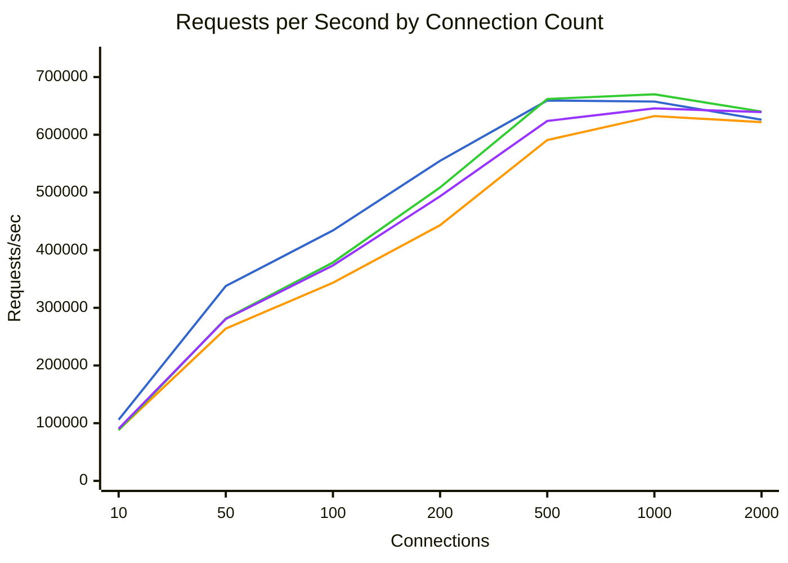
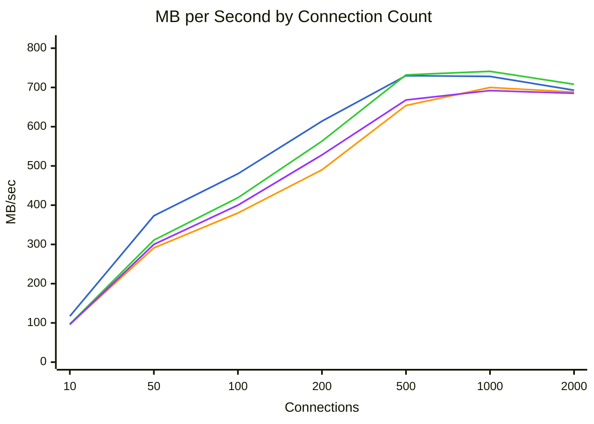
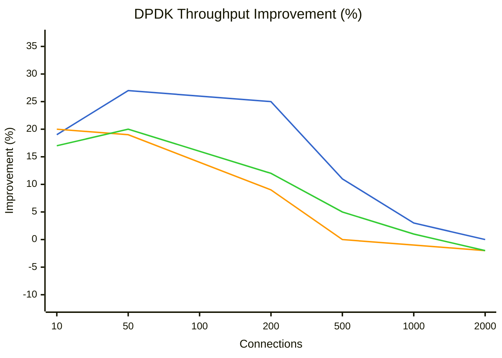
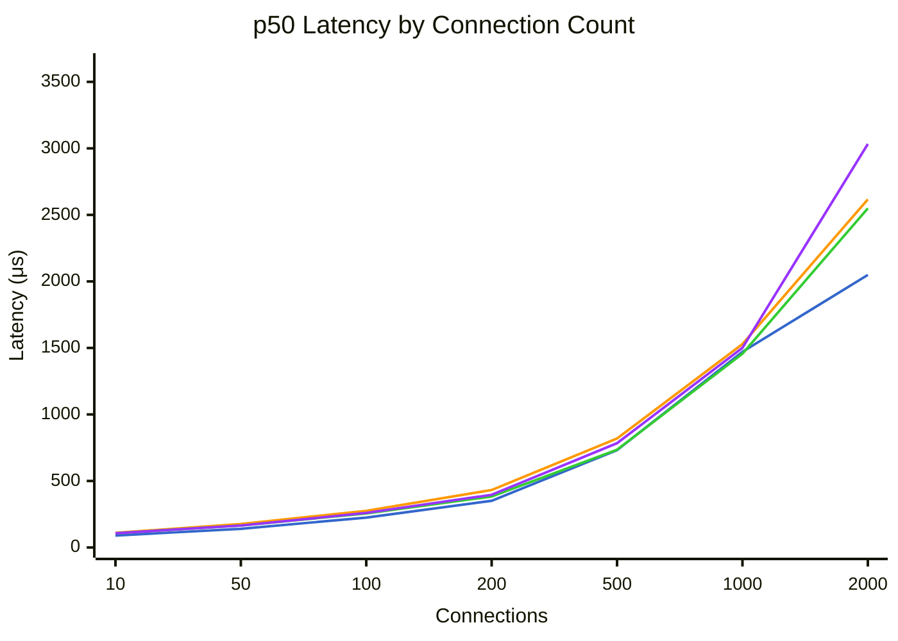
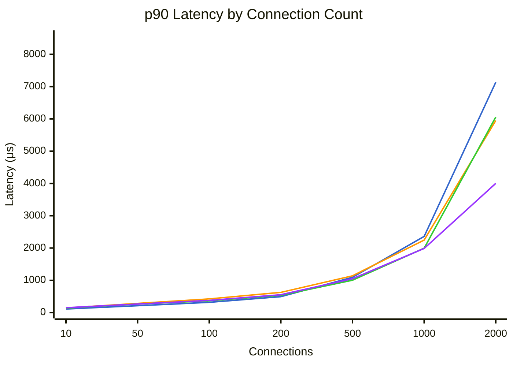
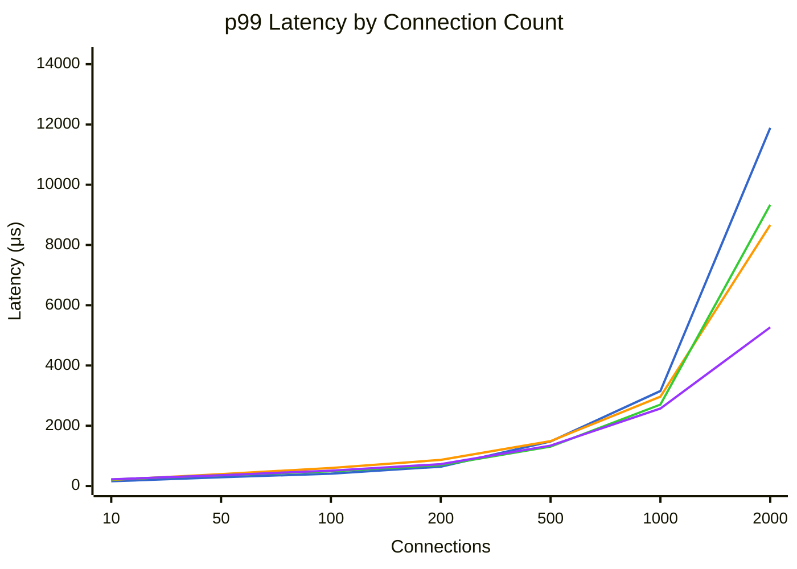

# Benchmark Comparison

Generated: 2026-01-29T20:59:06.408474

## Summary

| Mode | Connections | Requests/sec | MB/sec | p50 (μs) | p99 (μs) | Errors |
|------|-------------|--------------|--------|----------|----------|--------|
| dpdk | 10 | 105980 | 117.2 | 90 | 157 | 0 |
| dpdk | 50 | 337700 | 373.6 | 140 | 290 | 0 |
| dpdk | 100 | 434036 | 480.5 | 225 | 408 | 0 |
| dpdk | 200 | 554792 | 614.3 | 351 | 641 | 0 |
| dpdk | 500 | 659441 | 730.1 | 732 | 1477 | 0 |
| dpdk | 1000 | 657548 | 728.0 | 1471 | 3153 | 0 |
| dpdk | 2000 | 626037 | 693.2 | 2049 | 11887 | 0 |
| tokio | 10 | 88416 | 97.8 | 110 | 201 | 0 |
| tokio | 50 | 263920 | 292.0 | 177 | 396 | 0 |
| tokio | 100 | 343442 | 380.1 | 275 | 597 | 0 |
| tokio | 200 | 443090 | 490.6 | 432 | 867 | 0 |
| tokio | 500 | 590742 | 654.1 | 819 | 1489 | 0 |
| tokio | 1000 | 632396 | 700.2 | 1529 | 2965 | 0 |
| tokio | 2000 | 621795 | 688.5 | 2617 | 8663 | 0 |
| tokio-local | 10 | 87955 | 97.2 | 107 | 215 | 0 |
| tokio-local | 50 | 281419 | 311.3 | 165 | 356 | 0 |
| tokio-local | 100 | 378558 | 419.0 | 256 | 488 | 0 |
| tokio-local | 200 | 508663 | 563.2 | 383 | 693 | 0 |
| tokio-local | 500 | 661939 | 732.9 | 735 | 1307 | 0 |
| tokio-local | 1000 | 670076 | 741.9 | 1457 | 2703 | 0 |
| tokio-local | 2000 | 640162 | 708.8 | 2549 | 9335 | 0 |
| kimojio | 10 | 90536 | 96.9 | 107 | 222 | 0 |
| kimojio | 50 | 280624 | 300.5 | 165 | 358 | 0 |
| kimojio | 100 | 373395 | 400.1 | 260 | 510 | 0 |
| kimojio | 200 | 493325 | 528.8 | 396 | 724 | 0 |
| kimojio | 500 | 623860 | 668.7 | 784 | 1341 | 0 |
| kimojio | 1000 | 645699 | 692.1 | 1501 | 2571 | 0 |
| kimojio | 2000 | 639261 | 685.2 | 3033 | 5267 | 0 |

## Throughput Comparison



**Legend:** dpdk (blue) | tokio (orange) | tokio-local (green) | kimojio (purple)


## Bandwidth Comparison



**Legend:** dpdk (blue) | tokio (orange) | tokio-local (green) | kimojio (purple)


## DPDK Throughput Improvement

Percentage improvement of DPDK over other modes (positive = DPDK is faster).



**Legend:** vs tokio (blue) | vs tokio-local (orange) | vs kimojio (green)


## Latency Comparison (p50)



**Legend:** dpdk (blue) | tokio (orange) | tokio-local (green) | kimojio (purple)


## Latency Comparison (p90)



**Legend:** dpdk (blue) | tokio (orange) | tokio-local (green) | kimojio (purple)


## Latency Comparison (p99)



**Legend:** dpdk (blue) | tokio (orange) | tokio-local (green) | kimojio (purple)


## Raw Data

### dpdk

<details>
<summary>Click to expand</summary>

```json
{
  "benchmark_time": "2026-01-30T04:48:50+00:00",
  "results": [
    {
      "url": "http://10.0.0.5:8080/",
      "connections": 10,
      "duration_secs": 20.0,
      "mode": "raw",
      "worker_threads": 8,
      "timeout_ms": 5000,
      "requests": 2119594,
      "errors": 0,
      "gb_read": 2.29,
      "requests_per_sec": 105979.7,
      "mb_per_sec": 117.19,
      "latency": {
        "p50_us": 90,
        "p75_us": 100,
        "p90_us": 112,
        "p99_us": 157,
        "avg_us": 92,
        "max_us": 8447,
        "stdev_us": 38
      }
    },
    {
      "url": "http://10.0.0.5:8080/",
      "connections": 50,
      "duration_secs": 20.0,
      "mode": "raw",
      "worker_threads": 8,
      "timeout_ms": 5000,
      "requests": 6754002,
      "errors": 0,
      "gb_read": 7.3,
      "requests_per_sec": 337700.1,
      "mb_per_sec": 373.58,
      "latency": {
        "p50_us": 140,
        "p75_us": 174,
        "p90_us": 213,
        "p99_us": 290,
        "avg_us": 147,
        "max_us": 9215,
        "stdev_us": 50
      }
    },
    {
      "url": "http://10.0.0.5:8080/",
      "connections": 100,
      "duration_secs": 20.0,
      "mode": "raw",
      "worker_threads": 8,
      "timeout_ms": 5000,
      "requests": 8680717,
      "errors": 0,
      "gb_read": 9.39,
      "requests_per_sec": 434035.85,
      "mb_per_sec": 480.52,
      "latency": {
        "p50_us": 225,
        "p75_us": 272,
        "p90_us": 318,
        "p99_us": 408,
        "avg_us": 229,
        "max_us": 6951,
        "stdev_us": 72
      }
    },
    {
      "url": "http://10.0.0.5:8080/",
      "connections": 200,
      "duration_secs": 20.0,
      "mode": "raw",
      "worker_threads": 8,
      "timeout_ms": 5000,
      "requests": 11095846,
      "errors": 0,
      "gb_read": 12.0,
      "requests_per_sec": 554792.3,
      "mb_per_sec": 614.27,
      "latency": {
        "p50_us": 351,
        "p75_us": 421,
        "p90_us": 494,
        "p99_us": 641,
        "avg_us": 359,
        "max_us": 7319,
        "stdev_us": 105
      }
    },
    {
      "url": "http://10.0.0.5:8080/",
      "connections": 500,
      "duration_secs": 20.0,
      "mode": "raw",
      "worker_threads": 8,
      "timeout_ms": 5000,
      "requests": 13188811,
      "errors": 0,
      "gb_read": 14.26,
      "requests_per_sec": 659440.55,
      "mb_per_sec": 730.14,
      "latency": {
        "p50_us": 732,
        "p75_us": 907,
        "p90_us": 1094,
        "p99_us": 1477,
        "avg_us": 755,
        "max_us": 11455,
        "stdev_us": 263
      }
    },
    {
      "url": "http://10.0.0.5:8080/",
      "connections": 1000,
      "duration_secs": 20.0,
      "mode": "raw",
      "worker_threads": 8,
      "timeout_ms": 5000,
      "requests": 13150958,
      "errors": 0,
      "gb_read": 14.22,
      "requests_per_sec": 657547.9,
      "mb_per_sec": 728.05,
      "latency": {
        "p50_us": 1471,
        "p75_us": 1926,
        "p90_us": 2359,
        "p99_us": 3153,
        "avg_us": 1515,
        "max_us": 29583,
        "stdev_us": 645
      }
    },
    {
      "url": "http://10.0.0.5:8080/",
      "connections": 2000,
      "duration_secs": 20.0,
      "mode": "raw",
      "worker_threads": 8,
      "timeout_ms": 5000,
      "requests": 12520739,
      "errors": 0,
      "gb_read": 13.54,
      "requests_per_sec": 626036.95,
      "mb_per_sec": 693.16,
      "latency": {
        "p50_us": 2049,
        "p75_us": 4963,
        "p90_us": 7135,
        "p99_us": 11887,
        "avg_us": 3179,
        "max_us": 76607,
        "stdev_us": 2668
      }
    }
  ]
}
```

</details>

### tokio

<details>
<summary>Click to expand</summary>

```json
{
  "benchmark_time": "2026-01-30T04:52:08+00:00",
  "results": [
    {
      "url": "http://10.0.0.4:8080/",
      "connections": 10,
      "duration_secs": 20.0,
      "mode": "raw",
      "worker_threads": 8,
      "timeout_ms": 5000,
      "requests": 1768319,
      "errors": 0,
      "gb_read": 1.91,
      "requests_per_sec": 88415.95,
      "mb_per_sec": 97.76,
      "latency": {
        "p50_us": 110,
        "p75_us": 125,
        "p90_us": 142,
        "p99_us": 201,
        "avg_us": 112,
        "max_us": 5835,
        "stdev_us": 27
      }
    },
    {
      "url": "http://10.0.0.4:8080/",
      "connections": 50,
      "duration_secs": 20.0,
      "mode": "raw",
      "worker_threads": 8,
      "timeout_ms": 5000,
      "requests": 5278405,
      "errors": 0,
      "gb_read": 5.7,
      "requests_per_sec": 263920.25,
      "mb_per_sec": 291.96,
      "latency": {
        "p50_us": 177,
        "p75_us": 228,
        "p90_us": 285,
        "p99_us": 396,
        "avg_us": 189,
        "max_us": 6387,
        "stdev_us": 70
      }
    },
    {
      "url": "http://10.0.0.4:8080/",
      "connections": 100,
      "duration_secs": 20.0,
      "mode": "raw",
      "worker_threads": 8,
      "timeout_ms": 5000,
      "requests": 6868839,
      "errors": 0,
      "gb_read": 7.42,
      "requests_per_sec": 343441.95,
      "mb_per_sec": 380.12,
      "latency": {
        "p50_us": 275,
        "p75_us": 344,
        "p90_us": 425,
        "p99_us": 597,
        "avg_us": 290,
        "max_us": 8583,
        "stdev_us": 107
      }
    },
    {
      "url": "http://10.0.0.4:8080/",
      "connections": 200,
      "duration_secs": 20.0,
      "mode": "raw",
      "worker_threads": 8,
      "timeout_ms": 5000,
      "requests": 8861805,
      "errors": 0,
      "gb_read": 9.58,
      "requests_per_sec": 443090.25,
      "mb_per_sec": 490.6,
      "latency": {
        "p50_us": 432,
        "p75_us": 523,
        "p90_us": 626,
        "p99_us": 867,
        "avg_us": 449,
        "max_us": 12615,
        "stdev_us": 144
      }
    },
    {
      "url": "http://10.0.0.4:8080/",
      "connections": 500,
      "duration_secs": 20.0,
      "mode": "raw",
      "worker_threads": 8,
      "timeout_ms": 5000,
      "requests": 11814842,
      "errors": 0,
      "gb_read": 12.77,
      "requests_per_sec": 590742.1,
      "mb_per_sec": 654.08,
      "latency": {
        "p50_us": 819,
        "p75_us": 975,
        "p90_us": 1140,
        "p99_us": 1489,
        "avg_us": 843,
        "max_us": 14143,
        "stdev_us": 237
      }
    },
    {
      "url": "http://10.0.0.4:8080/",
      "connections": 1000,
      "duration_secs": 20.0,
      "mode": "raw",
      "worker_threads": 8,
      "timeout_ms": 5000,
      "requests": 12647914,
      "errors": 0,
      "gb_read": 13.68,
      "requests_per_sec": 632395.7,
      "mb_per_sec": 700.2,
      "latency": {
        "p50_us": 1529,
        "p75_us": 1884,
        "p90_us": 2247,
        "p99_us": 2965,
        "avg_us": 1575,
        "max_us": 31311,
        "stdev_us": 520
      }
    },
    {
      "url": "http://10.0.0.4:8080/",
      "connections": 2000,
      "duration_secs": 20.0,
      "mode": "raw",
      "worker_threads": 8,
      "timeout_ms": 5000,
      "requests": 12435903,
      "errors": 0,
      "gb_read": 13.45,
      "requests_per_sec": 621795.15,
      "mb_per_sec": 688.46,
      "latency": {
        "p50_us": 2617,
        "p75_us": 4143,
        "p90_us": 5951,
        "p99_us": 8663,
        "avg_us": 3201,
        "max_us": 74495,
        "stdev_us": 1866
      }
    }
  ]
}
```

</details>

### tokio-local

<details>
<summary>Click to expand</summary>

```json
{
  "benchmark_time": "2026-01-30T04:55:26+00:00",
  "results": [
    {
      "url": "http://10.0.0.4:8080/",
      "connections": 10,
      "duration_secs": 20.0,
      "mode": "raw",
      "worker_threads": 8,
      "timeout_ms": 5000,
      "requests": 1759102,
      "errors": 0,
      "gb_read": 1.9,
      "requests_per_sec": 87955.1,
      "mb_per_sec": 97.25,
      "latency": {
        "p50_us": 107,
        "p75_us": 122,
        "p90_us": 143,
        "p99_us": 215,
        "avg_us": 112,
        "max_us": 5611,
        "stdev_us": 36
      }
    },
    {
      "url": "http://10.0.0.4:8080/",
      "connections": 50,
      "duration_secs": 20.0,
      "mode": "raw",
      "worker_threads": 8,
      "timeout_ms": 5000,
      "requests": 5628383,
      "errors": 0,
      "gb_read": 6.08,
      "requests_per_sec": 281419.15,
      "mb_per_sec": 311.32,
      "latency": {
        "p50_us": 165,
        "p75_us": 213,
        "p90_us": 264,
        "p99_us": 356,
        "avg_us": 176,
        "max_us": 9423,
        "stdev_us": 65
      }
    },
    {
      "url": "http://10.0.0.4:8080/",
      "connections": 100,
      "duration_secs": 20.0,
      "mode": "raw",
      "worker_threads": 8,
      "timeout_ms": 5000,
      "requests": 7571150,
      "errors": 0,
      "gb_read": 8.18,
      "requests_per_sec": 378557.5,
      "mb_per_sec": 419.02,
      "latency": {
        "p50_us": 256,
        "p75_us": 310,
        "p90_us": 366,
        "p99_us": 488,
        "avg_us": 262,
        "max_us": 12199,
        "stdev_us": 94
      }
    },
    {
      "url": "http://10.0.0.4:8080/",
      "connections": 200,
      "duration_secs": 20.0,
      "mode": "raw",
      "worker_threads": 8,
      "timeout_ms": 5000,
      "requests": 10173259,
      "errors": 0,
      "gb_read": 11.0,
      "requests_per_sec": 508662.95,
      "mb_per_sec": 563.2,
      "latency": {
        "p50_us": 383,
        "p75_us": 459,
        "p90_us": 536,
        "p99_us": 693,
        "avg_us": 392,
        "max_us": 6967,
        "stdev_us": 113
      }
    },
    {
      "url": "http://10.0.0.4:8080/",
      "connections": 500,
      "duration_secs": 20.0,
      "mode": "raw",
      "worker_threads": 8,
      "timeout_ms": 5000,
      "requests": 13238786,
      "errors": 0,
      "gb_read": 14.31,
      "requests_per_sec": 661939.3,
      "mb_per_sec": 732.91,
      "latency": {
        "p50_us": 735,
        "p75_us": 865,
        "p90_us": 1004,
        "p99_us": 1307,
        "avg_us": 752,
        "max_us": 11287,
        "stdev_us": 207
      }
    },
    {
      "url": "http://10.0.0.4:8080/",
      "connections": 1000,
      "duration_secs": 20.0,
      "mode": "raw",
      "worker_threads": 8,
      "timeout_ms": 5000,
      "requests": 13401530,
      "errors": 0,
      "gb_read": 14.49,
      "requests_per_sec": 670076.5,
      "mb_per_sec": 741.92,
      "latency": {
        "p50_us": 1457,
        "p75_us": 1709,
        "p90_us": 1995,
        "p99_us": 2703,
        "avg_us": 1492,
        "max_us": 24047,
        "stdev_us": 430
      }
    },
    {
      "url": "http://10.0.0.4:8080/",
      "connections": 2000,
      "duration_secs": 20.0,
      "mode": "raw",
      "worker_threads": 8,
      "timeout_ms": 5000,
      "requests": 12803237,
      "errors": 0,
      "gb_read": 13.84,
      "requests_per_sec": 640161.85,
      "mb_per_sec": 708.8,
      "latency": {
        "p50_us": 2549,
        "p75_us": 3633,
        "p90_us": 6059,
        "p99_us": 9335,
        "avg_us": 3111,
        "max_us": 64319,
        "stdev_us": 1966
      }
    }
  ]
}
```

</details>

### kimojio

<details>
<summary>Click to expand</summary>

```json
{
  "benchmark_time": "2026-01-30T04:58:45+00:00",
  "results": [
    {
      "url": "http://10.0.0.4:8080/",
      "connections": 10,
      "duration_secs": 20.0,
      "mode": "raw",
      "worker_threads": 8,
      "timeout_ms": 5000,
      "requests": 1810721,
      "errors": 0,
      "gb_read": 1.89,
      "requests_per_sec": 90536.05,
      "mb_per_sec": 96.91,
      "latency": {
        "p50_us": 107,
        "p75_us": 126,
        "p90_us": 151,
        "p99_us": 222,
        "avg_us": 113,
        "max_us": 6143,
        "stdev_us": 38
      }
    },
    {
      "url": "http://10.0.0.4:8080/",
      "connections": 50,
      "duration_secs": 20.0,
      "mode": "raw",
      "worker_threads": 8,
      "timeout_ms": 5000,
      "requests": 5612484,
      "errors": 0,
      "gb_read": 5.87,
      "requests_per_sec": 280624.2,
      "mb_per_sec": 300.54,
      "latency": {
        "p50_us": 165,
        "p75_us": 213,
        "p90_us": 264,
        "p99_us": 358,
        "avg_us": 176,
        "max_us": 10407,
        "stdev_us": 74
      }
    },
    {
      "url": "http://10.0.0.4:8080/",
      "connections": 100,
      "duration_secs": 20.0,
      "mode": "raw",
      "worker_threads": 8,
      "timeout_ms": 5000,
      "requests": 7467894,
      "errors": 0,
      "gb_read": 7.82,
      "requests_per_sec": 373394.7,
      "mb_per_sec": 400.13,
      "latency": {
        "p50_us": 260,
        "p75_us": 318,
        "p90_us": 379,
        "p99_us": 510,
        "avg_us": 267,
        "max_us": 7995,
        "stdev_us": 87
      }
    },
    {
      "url": "http://10.0.0.4:8080/",
      "connections": 200,
      "duration_secs": 20.0,
      "mode": "raw",
      "worker_threads": 8,
      "timeout_ms": 5000,
      "requests": 9866498,
      "errors": 0,
      "gb_read": 10.33,
      "requests_per_sec": 493324.9,
      "mb_per_sec": 528.81,
      "latency": {
        "p50_us": 396,
        "p75_us": 474,
        "p90_us": 554,
        "p99_us": 724,
        "avg_us": 406,
        "max_us": 4335,
        "stdev_us": 114
      }
    },
    {
      "url": "http://10.0.0.4:8080/",
      "connections": 500,
      "duration_secs": 20.0,
      "mode": "raw",
      "worker_threads": 8,
      "timeout_ms": 5000,
      "requests": 12477190,
      "errors": 0,
      "gb_read": 13.06,
      "requests_per_sec": 623859.5,
      "mb_per_sec": 668.73,
      "latency": {
        "p50_us": 784,
        "p75_us": 913,
        "p90_us": 1049,
        "p99_us": 1341,
        "avg_us": 800,
        "max_us": 13559,
        "stdev_us": 210
      }
    },
    {
      "url": "http://10.0.0.4:8080/",
      "connections": 1000,
      "duration_secs": 20.0,
      "mode": "raw",
      "worker_threads": 8,
      "timeout_ms": 5000,
      "requests": 12913971,
      "errors": 0,
      "gb_read": 13.52,
      "requests_per_sec": 645698.55,
      "mb_per_sec": 692.14,
      "latency": {
        "p50_us": 1501,
        "p75_us": 1738,
        "p90_us": 1987,
        "p99_us": 2571,
        "avg_us": 1535,
        "max_us": 29167,
        "stdev_us": 380
      }
    },
    {
      "url": "http://10.0.0.4:8080/",
      "connections": 2000,
      "duration_secs": 20.0,
      "mode": "raw",
      "worker_threads": 8,
      "timeout_ms": 5000,
      "requests": 12785212,
      "errors": 0,
      "gb_read": 13.38,
      "requests_per_sec": 639260.6,
      "mb_per_sec": 685.24,
      "latency": {
        "p50_us": 3033,
        "p75_us": 3497,
        "p90_us": 4003,
        "p99_us": 5267,
        "avg_us": 3116,
        "max_us": 79679,
        "stdev_us": 804
      }
    }
  ]
}
```

</details>
