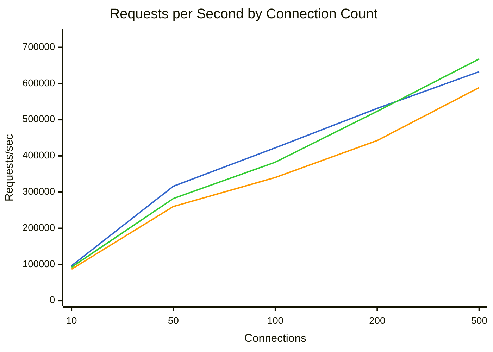
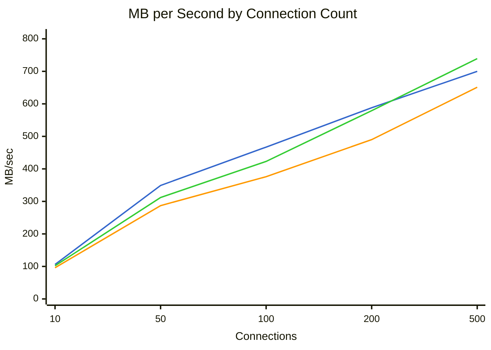
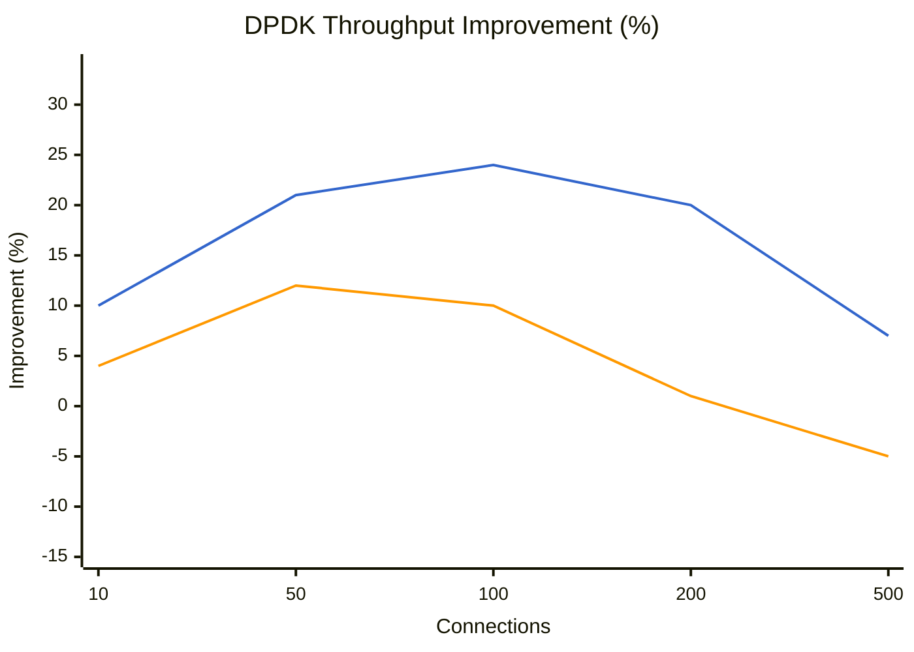
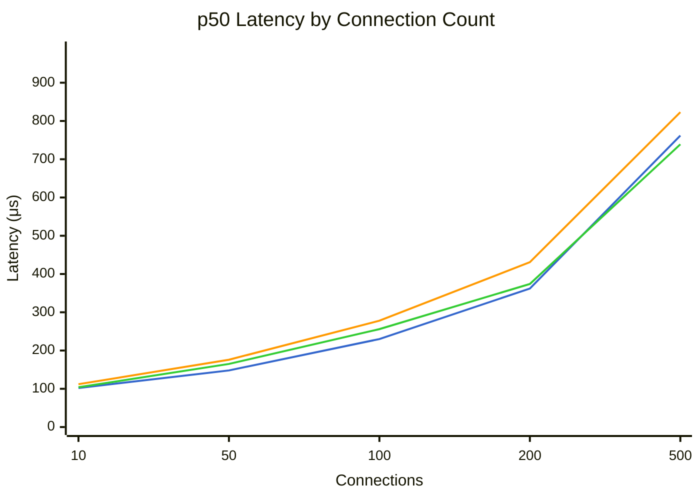
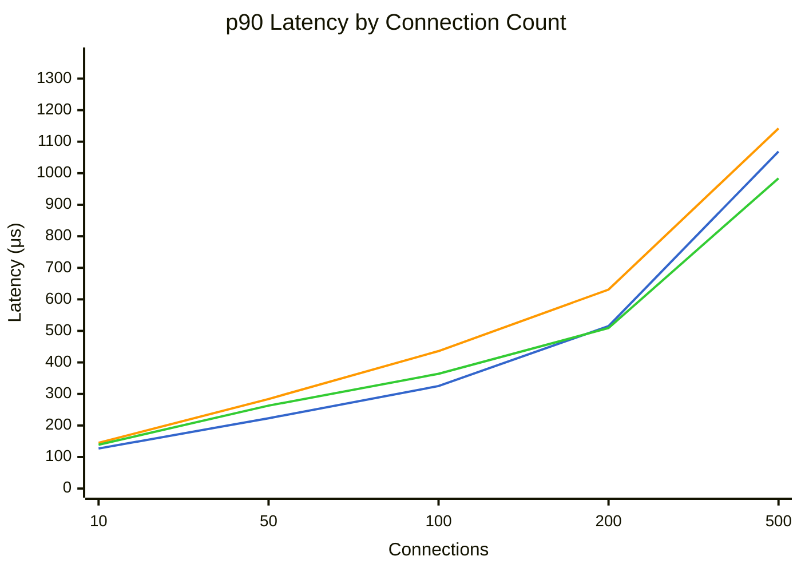
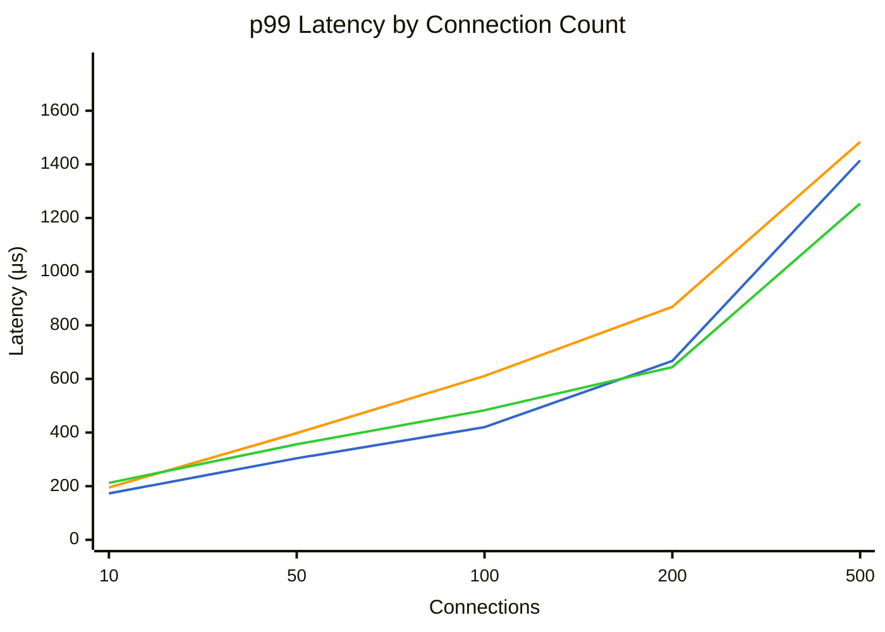

# Benchmark Comparison

Generated: 2026-01-25T10:49:14.686522

## Summary

| Mode | Connections | Requests/sec | MB/sec | p50 (μs) | p99 (μs) | Errors |
|------|-------------|--------------|--------|----------|----------|--------|
| dpdk | 10 | 96406 | 106.6 | 102 | 173 | 0 |
| dpdk | 50 | 316239 | 349.8 | 148 | 304 | 0 |
| dpdk | 100 | 422466 | 467.7 | 230 | 420 | 0 |
| dpdk | 200 | 531367 | 588.3 | 362 | 667 | 0 |
| dpdk | 500 | 632865 | 700.7 | 762 | 1415 | 0 |
| tokio | 10 | 86963 | 96.2 | 112 | 195 | 0 |
| tokio | 50 | 260231 | 287.9 | 176 | 398 | 0 |
| tokio | 100 | 340414 | 376.8 | 278 | 611 | 0 |
| tokio | 200 | 442576 | 490.0 | 431 | 869 | 0 |
| tokio | 500 | 588787 | 651.9 | 823 | 1484 | 0 |
| tokio-local | 10 | 92484 | 102.3 | 104 | 212 | 0 |
| tokio-local | 50 | 282285 | 312.3 | 165 | 356 | 0 |
| tokio-local | 100 | 382667 | 423.6 | 256 | 483 | 0 |
| tokio-local | 200 | 523271 | 579.4 | 374 | 644 | 0 |
| tokio-local | 500 | 667903 | 739.5 | 739 | 1254 | 0 |

## Throughput Comparison



**Legend:** dpdk (blue) | tokio (orange) | tokio-local (green)


## Bandwidth Comparison



**Legend:** dpdk (blue) | tokio (orange) | tokio-local (green)


## DPDK Throughput Improvement

Percentage improvement of DPDK over other modes (positive = DPDK is faster).



**Legend:** vs tokio (blue) | vs tokio-local (orange)


## Latency Comparison (p50)



**Legend:** dpdk (blue) | tokio (orange) | tokio-local (green)


## Latency Comparison (p90)



**Legend:** dpdk (blue) | tokio (orange) | tokio-local (green)


## Latency Comparison (p99)



**Legend:** dpdk (blue) | tokio (orange) | tokio-local (green)


## Raw Data

### dpdk

<details>
<summary>Click to expand</summary>

```json
{
  "benchmark_time": "2026-01-25T18:43:39+00:00",
  "results": [
    {
      "url": "http://10.0.0.5:8080/",
      "connections": 10,
      "duration_secs": 20.0,
      "mode": "raw",
      "worker_threads": 8,
      "timeout_ms": 5000,
      "requests": 1928110,
      "errors": 0,
      "gb_read": 2.08,
      "requests_per_sec": 96405.5,
      "mb_per_sec": 106.6,
      "latency": {
        "p50_us": 102,
        "p75_us": 114,
        "p90_us": 127,
        "p99_us": 173,
        "avg_us": 104,
        "max_us": 873,
        "stdev_us": 19
      }
    },
    {
      "url": "http://10.0.0.5:8080/",
      "connections": 50,
      "duration_secs": 20.0,
      "mode": "raw",
      "worker_threads": 8,
      "timeout_ms": 5000,
      "requests": 6324788,
      "errors": 0,
      "gb_read": 6.83,
      "requests_per_sec": 316239.4,
      "mb_per_sec": 349.84,
      "latency": {
        "p50_us": 148,
        "p75_us": 183,
        "p90_us": 223,
        "p99_us": 304,
        "avg_us": 157,
        "max_us": 1114,
        "stdev_us": 47
      }
    },
    {
      "url": "http://10.0.0.5:8080/",
      "connections": 100,
      "duration_secs": 20.0,
      "mode": "raw",
      "worker_threads": 8,
      "timeout_ms": 5000,
      "requests": 8449326,
      "errors": 0,
      "gb_read": 9.13,
      "requests_per_sec": 422466.3,
      "mb_per_sec": 467.68,
      "latency": {
        "p50_us": 230,
        "p75_us": 278,
        "p90_us": 325,
        "p99_us": 420,
        "avg_us": 236,
        "max_us": 8967,
        "stdev_us": 74
      }
    },
    {
      "url": "http://10.0.0.5:8080/",
      "connections": 200,
      "duration_secs": 20.0,
      "mode": "raw",
      "worker_threads": 8,
      "timeout_ms": 5000,
      "requests": 10627336,
      "errors": 0,
      "gb_read": 11.49,
      "requests_per_sec": 531366.8,
      "mb_per_sec": 588.34,
      "latency": {
        "p50_us": 362,
        "p75_us": 437,
        "p90_us": 515,
        "p99_us": 667,
        "avg_us": 374,
        "max_us": 4491,
        "stdev_us": 105
      }
    },
    {
      "url": "http://10.0.0.5:8080/",
      "connections": 500,
      "duration_secs": 20.0,
      "mode": "raw",
      "worker_threads": 8,
      "timeout_ms": 5000,
      "requests": 12657308,
      "errors": 0,
      "gb_read": 13.69,
      "requests_per_sec": 632865.4,
      "mb_per_sec": 700.72,
      "latency": {
        "p50_us": 762,
        "p75_us": 909,
        "p90_us": 1069,
        "p99_us": 1415,
        "avg_us": 785,
        "max_us": 11135,
        "stdev_us": 222
      }
    }
  ]
}
```

</details>

### tokio

<details>
<summary>Click to expand</summary>

```json
{
  "benchmark_time": "2026-01-25T18:46:11+00:00",
  "results": [
    {
      "url": "http://10.0.0.4:8080/",
      "connections": 10,
      "duration_secs": 20.0,
      "mode": "raw",
      "worker_threads": 8,
      "timeout_ms": 5000,
      "requests": 1739252,
      "errors": 0,
      "gb_read": 1.88,
      "requests_per_sec": 86962.6,
      "mb_per_sec": 96.15,
      "latency": {
        "p50_us": 112,
        "p75_us": 128,
        "p90_us": 145,
        "p99_us": 195,
        "avg_us": 114,
        "max_us": 1389,
        "stdev_us": 25
      }
    },
    {
      "url": "http://10.0.0.4:8080/",
      "connections": 50,
      "duration_secs": 20.0,
      "mode": "raw",
      "worker_threads": 8,
      "timeout_ms": 5000,
      "requests": 5204628,
      "errors": 0,
      "gb_read": 5.62,
      "requests_per_sec": 260231.4,
      "mb_per_sec": 287.88,
      "latency": {
        "p50_us": 176,
        "p75_us": 227,
        "p90_us": 284,
        "p99_us": 398,
        "avg_us": 189,
        "max_us": 203391,
        "stdev_us": 180
      }
    },
    {
      "url": "http://10.0.0.4:8080/",
      "connections": 100,
      "duration_secs": 20.0,
      "mode": "raw",
      "worker_threads": 8,
      "timeout_ms": 5000,
      "requests": 6808279,
      "errors": 0,
      "gb_read": 7.36,
      "requests_per_sec": 340413.95,
      "mb_per_sec": 376.77,
      "latency": {
        "p50_us": 278,
        "p75_us": 350,
        "p90_us": 436,
        "p99_us": 611,
        "avg_us": 294,
        "max_us": 2403,
        "stdev_us": 105
      }
    },
    {
      "url": "http://10.0.0.4:8080/",
      "connections": 200,
      "duration_secs": 20.0,
      "mode": "raw",
      "worker_threads": 8,
      "timeout_ms": 5000,
      "requests": 8851518,
      "errors": 0,
      "gb_read": 9.57,
      "requests_per_sec": 442575.9,
      "mb_per_sec": 490.03,
      "latency": {
        "p50_us": 431,
        "p75_us": 524,
        "p90_us": 631,
        "p99_us": 869,
        "avg_us": 449,
        "max_us": 206079,
        "stdev_us": 173
      }
    },
    {
      "url": "http://10.0.0.4:8080/",
      "connections": 500,
      "duration_secs": 20.0,
      "mode": "raw",
      "worker_threads": 8,
      "timeout_ms": 5000,
      "requests": 11775749,
      "errors": 0,
      "gb_read": 12.73,
      "requests_per_sec": 588787.45,
      "mb_per_sec": 651.91,
      "latency": {
        "p50_us": 823,
        "p75_us": 978,
        "p90_us": 1142,
        "p99_us": 1484,
        "avg_us": 846,
        "max_us": 11887,
        "stdev_us": 229
      }
    }
  ]
}
```

</details>

### tokio-local

<details>
<summary>Click to expand</summary>

```json
{
  "benchmark_time": "2026-01-25T18:48:42+00:00",
  "results": [
    {
      "url": "http://10.0.0.4:8080/",
      "connections": 10,
      "duration_secs": 20.0,
      "mode": "raw",
      "worker_threads": 8,
      "timeout_ms": 5000,
      "requests": 1849683,
      "errors": 0,
      "gb_read": 2.0,
      "requests_per_sec": 92484.15,
      "mb_per_sec": 102.26,
      "latency": {
        "p50_us": 104,
        "p75_us": 119,
        "p90_us": 139,
        "p99_us": 212,
        "avg_us": 109,
        "max_us": 1039,
        "stdev_us": 27
      }
    },
    {
      "url": "http://10.0.0.4:8080/",
      "connections": 50,
      "duration_secs": 20.0,
      "mode": "raw",
      "worker_threads": 8,
      "timeout_ms": 5000,
      "requests": 5645694,
      "errors": 0,
      "gb_read": 6.1,
      "requests_per_sec": 282284.7,
      "mb_per_sec": 312.28,
      "latency": {
        "p50_us": 165,
        "p75_us": 212,
        "p90_us": 263,
        "p99_us": 356,
        "avg_us": 176,
        "max_us": 13383,
        "stdev_us": 72
      }
    },
    {
      "url": "http://10.0.0.4:8080/",
      "connections": 100,
      "duration_secs": 20.0,
      "mode": "raw",
      "worker_threads": 8,
      "timeout_ms": 5000,
      "requests": 7653348,
      "errors": 0,
      "gb_read": 8.27,
      "requests_per_sec": 382667.4,
      "mb_per_sec": 423.58,
      "latency": {
        "p50_us": 256,
        "p75_us": 309,
        "p90_us": 364,
        "p99_us": 483,
        "avg_us": 261,
        "max_us": 9519,
        "stdev_us": 85
      }
    },
    {
      "url": "http://10.0.0.4:8080/",
      "connections": 200,
      "duration_secs": 20.0,
      "mode": "raw",
      "worker_threads": 8,
      "timeout_ms": 5000,
      "requests": 10465423,
      "errors": 0,
      "gb_read": 11.32,
      "requests_per_sec": 523271.15,
      "mb_per_sec": 579.37,
      "latency": {
        "p50_us": 374,
        "p75_us": 441,
        "p90_us": 509,
        "p99_us": 644,
        "avg_us": 380,
        "max_us": 4883,
        "stdev_us": 99
      }
    },
    {
      "url": "http://10.0.0.4:8080/",
      "connections": 500,
      "duration_secs": 20.0,
      "mode": "raw",
      "worker_threads": 8,
      "timeout_ms": 5000,
      "requests": 13358061,
      "errors": 0,
      "gb_read": 14.44,
      "requests_per_sec": 667903.05,
      "mb_per_sec": 739.51,
      "latency": {
        "p50_us": 739,
        "p75_us": 861,
        "p90_us": 984,
        "p99_us": 1254,
        "avg_us": 750,
        "max_us": 13335,
        "stdev_us": 193
      }
    }
  ]
}
```

</details>
