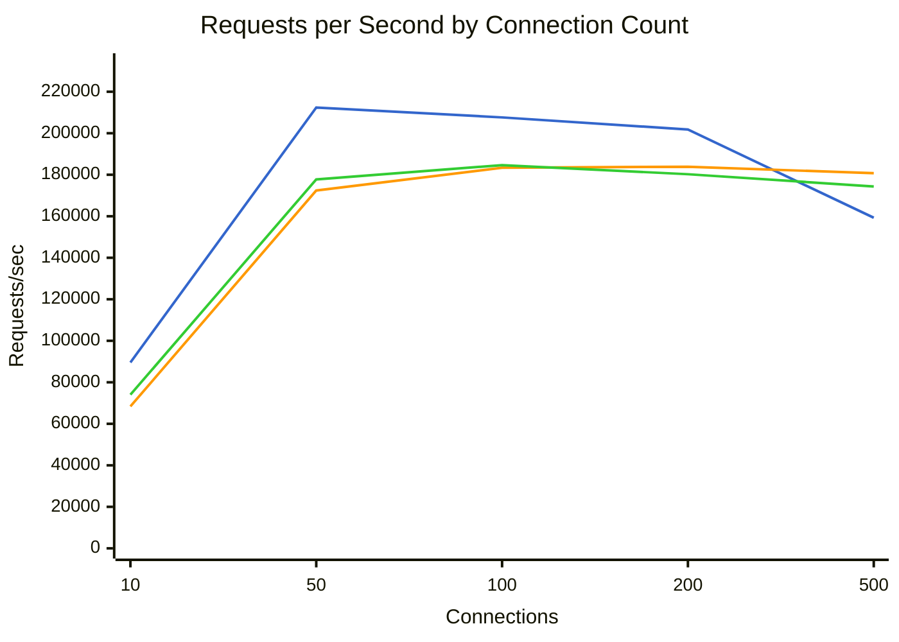
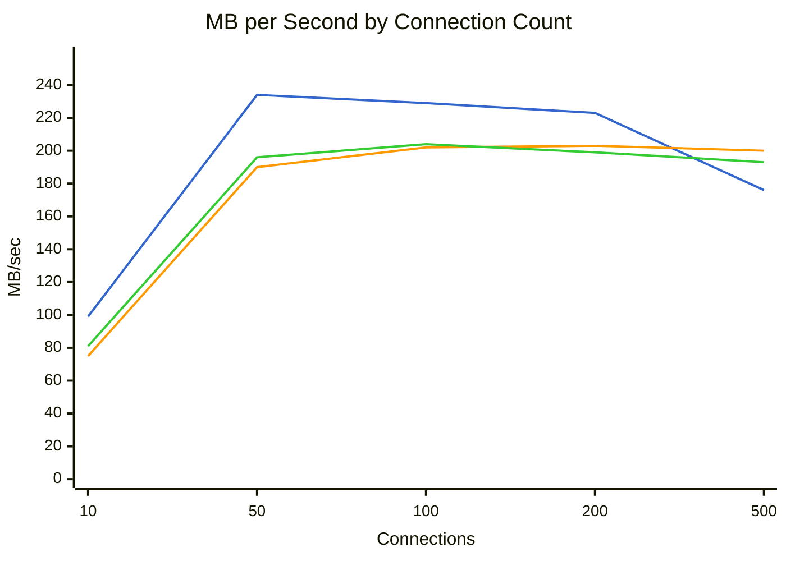
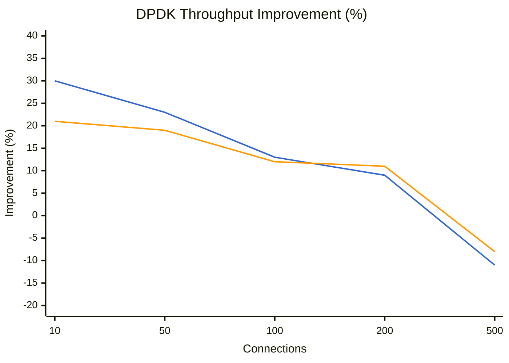
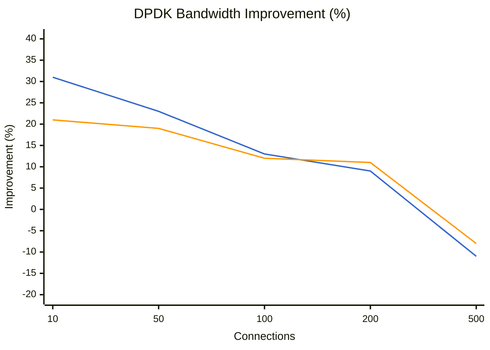
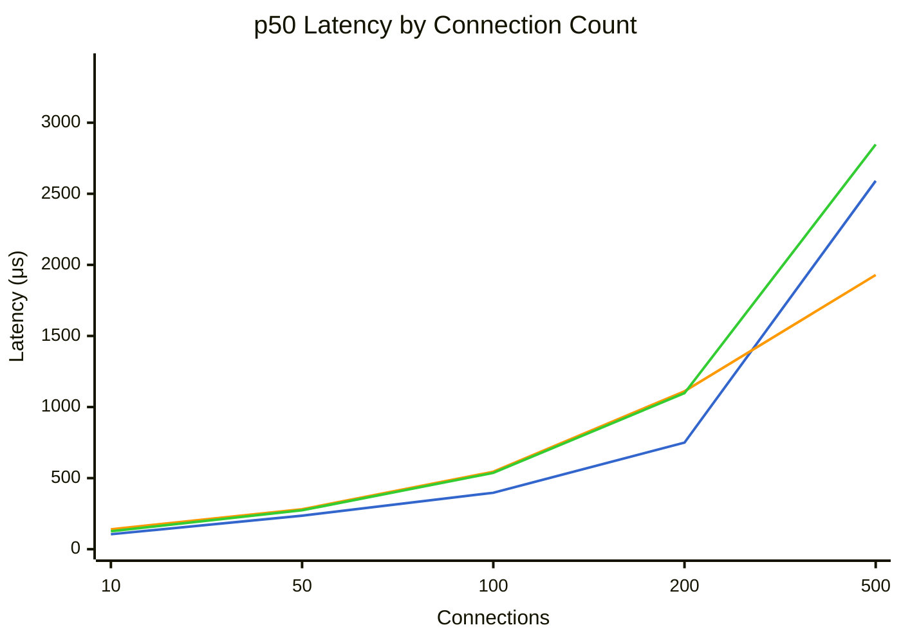
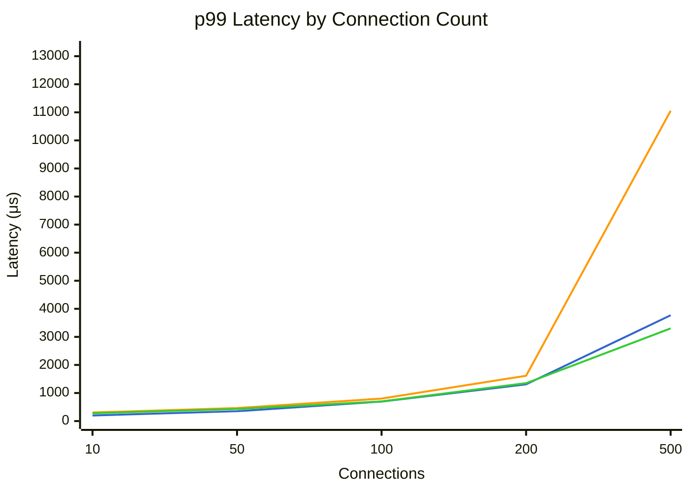

# Benchmark Comparison

Generated: 2026-01-24T14:47:06.593134

## Summary

| Mode | Connections | Requests/sec | MB/sec | p50 (μs) | p99 (μs) | Errors |
|------|-------------|--------------|--------|----------|----------|--------|
| dpdk | 10 | 89565 | 99.0 | 105 | 198 | 0 |
| dpdk | 50 | 212373 | 234.9 | 236 | 351 | 0 |
| dpdk | 100 | 207619 | 229.7 | 397 | 696 | 76 |
| dpdk | 200 | 201788 | 223.4 | 750 | 1308 | 181 |
| dpdk | 500 | 159286 | 176.4 | 2591 | 3769 | 463 |
| tokio | 10 | 68373 | 75.6 | 140 | 306 | 0 |
| tokio | 50 | 172421 | 190.7 | 281 | 465 | 0 |
| tokio | 100 | 183371 | 202.9 | 545 | 802 | 0 |
| tokio | 200 | 183862 | 203.5 | 1111 | 1614 | 0 |
| tokio | 500 | 180745 | 200.1 | 1929 | 11055 | 0 |
| tokio-local | 10 | 74018 | 81.8 | 126 | 279 | 0 |
| tokio-local | 50 | 177762 | 196.7 | 274 | 430 | 0 |
| tokio-local | 100 | 184628 | 204.2 | 537 | 699 | 0 |
| tokio-local | 200 | 180254 | 199.5 | 1098 | 1349 | 0 |
| tokio-local | 500 | 174338 | 193.0 | 2847 | 3301 | 0 |

## Throughput Comparison



**Legend:** dpdk (blue) | tokio (orange) | tokio-local (green)


## Bandwidth Comparison



**Legend:** dpdk (blue) | tokio (orange) | tokio-local (green)


## DPDK Throughput Improvement

Percentage improvement of DPDK over other modes (positive = DPDK is faster).



**Legend:** vs tokio (blue) | vs tokio-local (orange)


## DPDK Bandwidth Improvement

Percentage improvement of DPDK over other modes (positive = DPDK is faster).



**Legend:** vs tokio (blue) | vs tokio-local (orange)


## Latency Comparison (p50)



**Legend:** dpdk (blue) | tokio (orange) | tokio-local (green)


## Latency Comparison (p99)



**Legend:** dpdk (blue) | tokio (orange) | tokio-local (green)


## Raw Data

### dpdk

<details>
<summary>Click to expand</summary>

```json
{
  "benchmark_time": "2026-01-24T22:05:49+00:00",
  "results": [
    {
      "url": "http://10.0.0.5:8080/",
      "connections": 10,
      "duration_secs": 20.0,
      "mode": "raw",
      "worker_threads": 2,
      "timeout_ms": 5000,
      "requests": 1791298,
      "errors": 0,
      "gb_read": 1.93,
      "requests_per_sec": 89564.9,
      "mb_per_sec": 99.03,
      "latency": {
        "p50_us": 105,
        "p75_us": 128,
        "p90_us": 152,
        "p99_us": 198,
        "avg_us": 110,
        "max_us": 2417,
        "stdev_us": 30
      }
    },
    {
      "url": "http://10.0.0.5:8080/",
      "connections": 50,
      "duration_secs": 20.0,
      "mode": "raw",
      "worker_threads": 2,
      "timeout_ms": 5000,
      "requests": 4247468,
      "errors": 0,
      "gb_read": 4.59,
      "requests_per_sec": 212373.4,
      "mb_per_sec": 234.94,
      "latency": {
        "p50_us": 236,
        "p75_us": 268,
        "p90_us": 298,
        "p99_us": 351,
        "avg_us": 235,
        "max_us": 5599,
        "stdev_us": 62
      }
    },
    {
      "url": "http://10.0.0.5:8080/",
      "connections": 100,
      "duration_secs": 20.0,
      "mode": "raw",
      "worker_threads": 2,
      "timeout_ms": 5000,
      "requests": 4152373,
      "errors": 76,
      "gb_read": 4.49,
      "requests_per_sec": 207618.65,
      "mb_per_sec": 229.69,
      "error_samples": [
        "timeout",
        "timeout",
        "timeout",
        "timeout",
        "timeout"
      ],
      "latency": {
        "p50_us": 397,
        "p75_us": 493,
        "p90_us": 564,
        "p99_us": 696,
        "avg_us": 398,
        "max_us": 7255,
        "stdev_us": 136
      }
    },
    {
      "url": "http://10.0.0.5:8080/",
      "connections": 200,
      "duration_secs": 20.0,
      "mode": "raw",
      "worker_threads": 2,
      "timeout_ms": 5000,
      "requests": 4035751,
      "errors": 181,
      "gb_read": 4.36,
      "requests_per_sec": 201787.55,
      "mb_per_sec": 223.42,
      "error_samples": [
        "connect timeout",
        "connect timeout",
        "connect timeout",
        "connect timeout",
        "connect timeout"
      ],
      "latency": {
        "p50_us": 750,
        "p75_us": 963,
        "p90_us": 1121,
        "p99_us": 1308,
        "avg_us": 759,
        "max_us": 10079,
        "stdev_us": 257
      }
    },
    {
      "url": "http://10.0.0.5:8080/",
      "connections": 500,
      "duration_secs": 20.0,
      "mode": "raw",
      "worker_threads": 2,
      "timeout_ms": 5000,
      "requests": 3185711,
      "errors": 463,
      "gb_read": 3.44,
      "requests_per_sec": 159285.55,
      "mb_per_sec": 176.36,
      "error_samples": [
        "connect timeout",
        "connect timeout",
        "connect timeout",
        "connect timeout",
        "connect timeout"
      ],
      "latency": {
        "p50_us": 2591,
        "p75_us": 3143,
        "p90_us": 3321,
        "p99_us": 3769,
        "avg_us": 2414,
        "max_us": 28623,
        "stdev_us": 817
      }
    }
  ]
}
```

</details>

### tokio

<details>
<summary>Click to expand</summary>

```json
{
  "benchmark_time": "2026-01-24T22:08:21+00:00",
  "results": [
    {
      "url": "http://10.0.0.4:8080/",
      "connections": 10,
      "duration_secs": 20.0,
      "mode": "raw",
      "worker_threads": 2,
      "timeout_ms": 5000,
      "requests": 1367452,
      "errors": 0,
      "gb_read": 1.48,
      "requests_per_sec": 68372.6,
      "mb_per_sec": 75.59,
      "latency": {
        "p50_us": 140,
        "p75_us": 177,
        "p90_us": 231,
        "p99_us": 306,
        "avg_us": 149,
        "max_us": 2413,
        "stdev_us": 55
      }
    },
    {
      "url": "http://10.0.0.4:8080/",
      "connections": 50,
      "duration_secs": 20.0,
      "mode": "raw",
      "worker_threads": 2,
      "timeout_ms": 5000,
      "requests": 3448417,
      "errors": 0,
      "gb_read": 3.73,
      "requests_per_sec": 172420.85,
      "mb_per_sec": 190.74,
      "latency": {
        "p50_us": 281,
        "p75_us": 330,
        "p90_us": 388,
        "p99_us": 465,
        "avg_us": 289,
        "max_us": 7827,
        "stdev_us": 79
      }
    },
    {
      "url": "http://10.0.0.4:8080/",
      "connections": 100,
      "duration_secs": 20.0,
      "mode": "raw",
      "worker_threads": 2,
      "timeout_ms": 5000,
      "requests": 3667411,
      "errors": 0,
      "gb_read": 3.96,
      "requests_per_sec": 183370.55,
      "mb_per_sec": 202.86,
      "latency": {
        "p50_us": 545,
        "p75_us": 626,
        "p90_us": 687,
        "p99_us": 802,
        "avg_us": 544,
        "max_us": 207743,
        "stdev_us": 184
      }
    },
    {
      "url": "http://10.0.0.4:8080/",
      "connections": 200,
      "duration_secs": 20.0,
      "mode": "raw",
      "worker_threads": 2,
      "timeout_ms": 5000,
      "requests": 3677237,
      "errors": 0,
      "gb_read": 3.97,
      "requests_per_sec": 183861.85,
      "mb_per_sec": 203.5,
      "latency": {
        "p50_us": 1111,
        "p75_us": 1271,
        "p90_us": 1395,
        "p99_us": 1614,
        "avg_us": 1085,
        "max_us": 7431,
        "stdev_us": 269
      }
    },
    {
      "url": "http://10.0.0.4:8080/",
      "connections": 500,
      "duration_secs": 20.0,
      "mode": "raw",
      "worker_threads": 2,
      "timeout_ms": 5000,
      "requests": 3614900,
      "errors": 0,
      "gb_read": 3.91,
      "requests_per_sec": 180745.0,
      "mb_per_sec": 200.12,
      "latency": {
        "p50_us": 1929,
        "p75_us": 2689,
        "p90_us": 5967,
        "p99_us": 11055,
        "avg_us": 2761,
        "max_us": 29711,
        "stdev_us": 2215
      }
    }
  ]
}
```

</details>

### tokio-local

<details>
<summary>Click to expand</summary>

```json
{
  "benchmark_time": "2026-01-24T22:10:53+00:00",
  "results": [
    {
      "url": "http://10.0.0.4:8080/",
      "connections": 10,
      "duration_secs": 20.0,
      "mode": "raw",
      "worker_threads": 2,
      "timeout_ms": 5000,
      "requests": 1480363,
      "errors": 0,
      "gb_read": 1.6,
      "requests_per_sec": 74018.15,
      "mb_per_sec": 81.83,
      "latency": {
        "p50_us": 126,
        "p75_us": 155,
        "p90_us": 193,
        "p99_us": 279,
        "avg_us": 132,
        "max_us": 2445,
        "stdev_us": 47
      }
    },
    {
      "url": "http://10.0.0.4:8080/",
      "connections": 50,
      "duration_secs": 20.0,
      "mode": "raw",
      "worker_threads": 2,
      "timeout_ms": 5000,
      "requests": 3555250,
      "errors": 0,
      "gb_read": 3.84,
      "requests_per_sec": 177762.5,
      "mb_per_sec": 196.65,
      "latency": {
        "p50_us": 274,
        "p75_us": 303,
        "p90_us": 355,
        "p99_us": 430,
        "avg_us": 281,
        "max_us": 207871,
        "stdev_us": 153
      }
    },
    {
      "url": "http://10.0.0.4:8080/",
      "connections": 100,
      "duration_secs": 20.0,
      "mode": "raw",
      "worker_threads": 2,
      "timeout_ms": 5000,
      "requests": 3692558,
      "errors": 0,
      "gb_read": 3.99,
      "requests_per_sec": 184627.9,
      "mb_per_sec": 204.25,
      "latency": {
        "p50_us": 537,
        "p75_us": 568,
        "p90_us": 613,
        "p99_us": 699,
        "avg_us": 539,
        "max_us": 206975,
        "stdev_us": 168
      }
    },
    {
      "url": "http://10.0.0.4:8080/",
      "connections": 200,
      "duration_secs": 20.0,
      "mode": "raw",
      "worker_threads": 2,
      "timeout_ms": 5000,
      "requests": 3605078,
      "errors": 0,
      "gb_read": 3.9,
      "requests_per_sec": 180253.9,
      "mb_per_sec": 199.52,
      "latency": {
        "p50_us": 1098,
        "p75_us": 1188,
        "p90_us": 1231,
        "p99_us": 1349,
        "avg_us": 1106,
        "max_us": 10783,
        "stdev_us": 119
      }
    },
    {
      "url": "http://10.0.0.4:8080/",
      "connections": 500,
      "duration_secs": 20.0,
      "mode": "raw",
      "worker_threads": 2,
      "timeout_ms": 5000,
      "requests": 3486766,
      "errors": 0,
      "gb_read": 3.77,
      "requests_per_sec": 174338.3,
      "mb_per_sec": 193.03,
      "latency": {
        "p50_us": 2847,
        "p75_us": 2953,
        "p90_us": 3045,
        "p99_us": 3301,
        "avg_us": 2865,
        "max_us": 24847,
        "stdev_us": 257
      }
    }
  ]
}
```

</details>
